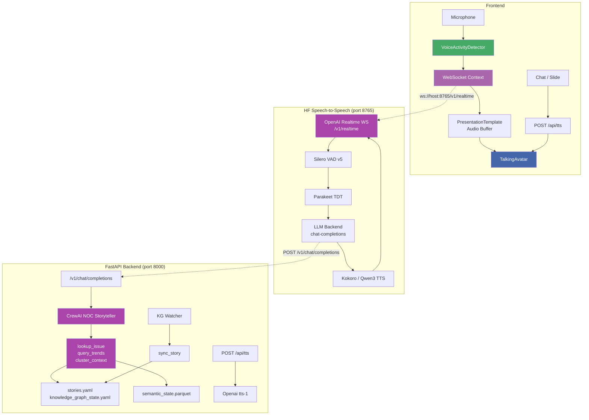
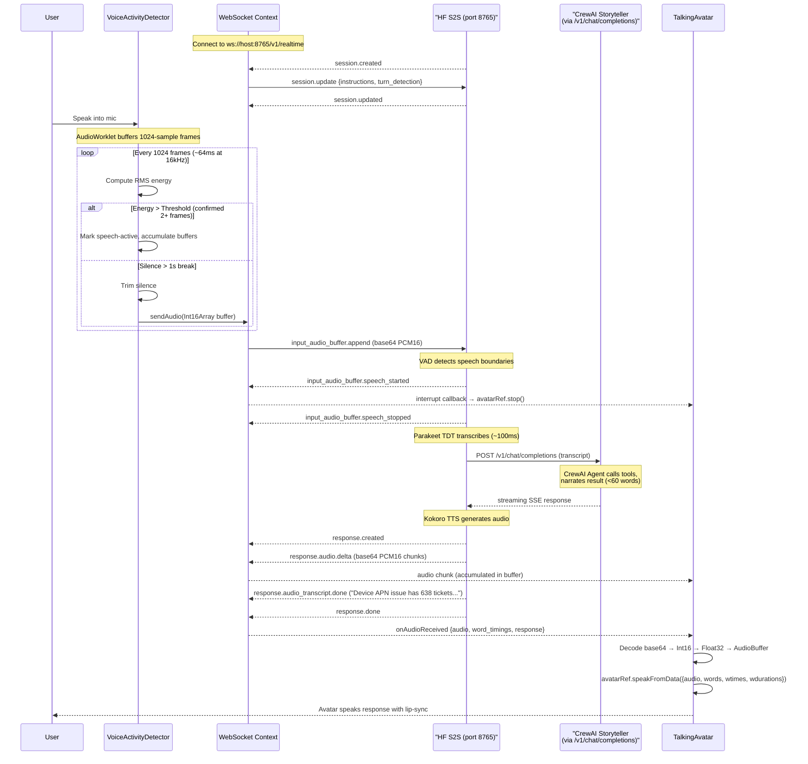
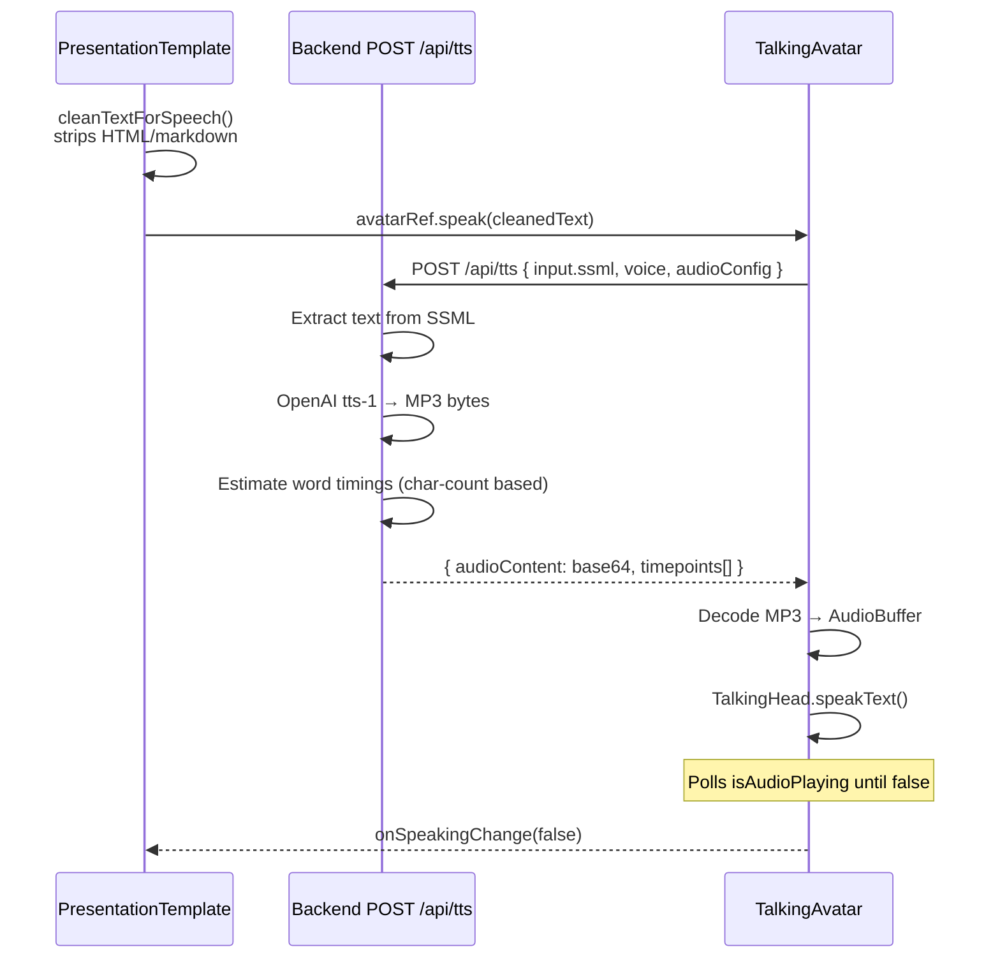

# Audio Pipeline Architecture

## Overview

The system has **two independent audio pipelines** and a **text-to-speech (TTS) fallback**:

| Pipeline | Latency | Quality | Use Case |
|----------|---------|---------|----------|
| **Voice (Real-time)** | ~500ms-2s | HF S2S Parakeet TDT STT + Kokoro TTS | Mic → VAD → Realtime Protocol → CrewAI Agent → Avatar |
| **TTS (Narration)** | Instant | OpenAI `tts-1` | Slide narration, chat responses |
| **TTS (speak)** | Instant | OpenAI `tts-1` | Programmatic `avatarRef.speak(text)` |

---

## High-Level Architecture



---

## Pipeline 1: Real-Time Voice (Mic → Avatar)

Uses HuggingFace **speech-to-speech** in `--mode realtime` (OpenAI Realtime protocol). The frontend sends raw PCM16 audio via `input_audio_buffer.append` events and receives audio via `response.audio.delta` / `response.audio_transcript.done` events.

### Sequence



### Chunked Streaming

The frontend accumulates `response.audio.delta` chunks (started on `response.created`) and assembles them on `response.done`:

```
response.created  → clear buffer, start fresh
audio.delta[0]    → push to buffer, fire onAudioChunk (chunk_index=0, start 2s timer)
audio.delta[1]    → push to buffer
...
response.done     → merge all deltas → estimate word timings → fire onAudioReceived
```

This mirrors the original chunked streaming approach but uses the Realtime protocol's event lifecycle instead of a custom `chunk_index` field.

### Word Timing (Lip-Sync)

Since the Realtime protocol does not provide per-word timestamps, the frontend **estimates** them by dividing the total audio duration evenly across all words in the assistant's transcript:

```
totalWords = transcript.split(/\s+/).length
perWordMs = totalDurationMs / totalWords
wordTimings = transcript.words.map((w, i) => ({
    word: w,
    start_time: i * perWordMs,
    end_time: (i + 1) * perWordMs,
}))
```

This provides functional but approximate lip-sync. A future upgrade could replace this with server-side forced alignment (e.g., Montreal Forced Aligner or CTC alignment).

---

## Pipeline 2: TTS Narration (Text → Avatar)

Unchanged — uses OpenAI `tts-1` via `POST /api/tts`.



---

## HuggingFace Speech-to-Speech Integration

The voice pipeline delegates all audio processing to HF's `speech-to-speech` library (`--mode realtime`):

| Component | HF S2S Backend | Sample Rate |
|-----------|----------------|-------------|
| VAD | Silero VAD v5 | 16kHz |
| STT | Parakeet TDT | 16kHz (sub-100ms latency) |
| LLM | `chat-completions` → our `/v1/chat/completions` | — |
| TTS | Kokoro (or Qwen3-TTS) | 16kHz |

The LLM backend (`--llm_backend chat-completions`) connects to a thin FastAPI router (`storyteller_chat.py`) that wraps the CrewAI NOC Storyteller agent.

### Subprocess Lifecycle

HF S2S runs as a managed subprocess launched from `main.py`'s startup hook:

1. FastAPI starts on port 8000
2. On `startup` event: init Storyteller agent, launch HF S2S subprocess
3. HF S2S binds to port 8765 (OpenAI Realtime WebSocket at `/v1/realtime`)
4. On `shutdown` event: `SIGINT` → graceful stop → `SIGKILL` on timeout
5. HF S2S logs are forwarded to the main logger via async `readline()`

### Conversation State

HF S2S manages per-connection history internally via its `Chat` class (`ConnState.runtime_config.chat`). The conversation history in `session.update.instructions` is set once on connection.

---

## VoiceActivityDetector Deep Dive

Unchanged — see prior documentation. The VAD continues to run at 16kHz, converting Float32 → Int16 PCM16 before passing to `sendAudio()`.

### Key Integration Point

`sendAudio()` now sends an `input_audio_buffer.append` event instead of a raw JSON `{audio: b64}`:

```
Old: ws.send(JSON.stringify({ audio: b64 }))
New: ws.send(JSON.stringify({ type: "input_audio_buffer.append", audio: b64 }))
```

No other changes to the VAD logic.

---

## Backend Components

### storyteller_chat.py (NEW)

| Property | Value |
|----------|-------|
| Endpoint | `POST /v1/chat/completions` |
| Protocol | OpenAI Chat Completions streaming (SSE) |
| Input | `{ model, messages: [{role, content}], stream }` |
| Output | SSE `data: {"choices":[{"delta":{"content":"..."}}]}` + `data: [DONE]` |

Wraps `run_storyteller(query, history)`: extracts last `user` message as query, builds history from preceding user messages, streams agent response as sentence-level delta chunks.

### CrewAI NOC Storyteller (Response Generation)

| Property | Value |
|----------|-------|
| **Agent** | Singleton `NOC Storyteller` CrewAI agent initialized at app startup |
| **System prompt** | Senior NOC operator persona, clear authoritative tone, frames data as narrative |
| **Target response length** | Under 60 words, conversational for TTS |
| **Tools** | `lookup_issue(name)` — reads `stories.yaml` + `knowledge_graph_state.yaml` + edges. `query_trends(query)` — reads KG columns and edges. `cluster_context(name)` — reads `semantic_state.parquet`. |
| **Conversation history** | Last 10 exchanges per connection, managed by HF S2S's `Chat` class internally. Injected via `session.update.instructions` and the `/v1/chat/completions` message array. |
| **Fallback** | `_fallback_narration()` — reads YAML directly if CrewAI/LLM is unavailable |
| **Model** | `settings.openai_model` via CrewAI's internal LLM binding |

### Interrupt Mechanism

| Trigger | What happens |
|---------|--------------|
| New `input_audio_buffer.append` while avatar is speaking | HF S2S VAD detects speech → `input_audio_buffer.speech_started` event → frontend `onInterrupt` fires → `avatarRef.stop()` + buffer cleared |
| HF S2S internal | `CancelScope` with generation counters prevents stale agent responses |
| Backend | No explicit kill_switch needed — HF S2S manages cancellation internally |

### Background Sync: KG Watcher

Unchanged — `sync_watcher.py` (30s poll, 60s debounce) + `sync_story.py` (orphan detection, direct-LLM SOP generation).

---

## File Reference

### Frontend

| File | Role | Key Exports |
|------|------|-------------|
| `contexts/WebSocketContext.tsx` | OpenAI Realtime protocol WebSocket, input_audio_buffer.append | `WebSocketProvider`, `useWebSocket()` |
| `components/voice/VoiceActivityDetector.tsx` | Audio capture, VAD, noise calibration, send | `VoiceActivityDetector` |
| `components/voice/CameraStream.tsx` | Camera capture | `CameraStream` |
| `components/.../PresentationTemplate.tsx` | Audio buffer management, chunk accumulation, speak dispatch | `PresentationBody` |
| `components/.../TalkingAvatar.tsx` | `speak()`, `speakFromData()`, `stop()`, `pollAudioEnd()` | `TalkingAvatar`, `TalkingAvatarHandle` |

### Backend

| File | Role | Endpoints |
|------|------|-----------|
| `routers/storyteller_chat.py` | OpenAI-compatible `/v1/chat/completions` bridge → `run_storyteller()` | `POST /v1/chat/completions` |
| `routers/tts.py` | OpenAI TTS synthesis | `POST /api/tts` |
| `datastory/crewai_storyteller.py` | CrewAI agent singleton, 3 tools, `run_storyteller()`, deterministic `run_cluster_story()` | — |
| `datastory/sync_story.py` | YAML sync — detect orphans/generate SOP/update counts | — |
| `datastory/sync_watcher.py` | Background polling file watcher for KG changes | — |
| `main.py` | Startup: `init_storyteller()` + `watch_kg_state()` + HF S2S subprocess launch | — |

### External

| Process | Port | Protocol |
|---------|------|----------|
| HF speech-to-speech | 8765 | OpenAI Realtime WebSocket (`/v1/realtime`) |

---

## Integration Checklist

- [ ] **VAD**: Click mic → speak "wake up" → avatar materializes and responds
- [ ] **VAD echo cancellation**: While avatar speaks, mic source disconnected (`sourceNodeRef.current.disconnect()`)
- [ ] **Realtime connection**: Frontend connects to `ws://host:8765/v1/realtime` → receives `session.created`
- [ ] **Session config**: Frontend sends `session.update` with instructions + turn_detection → receives `session.updated`
- [ ] **Voice pipeline**: Speak "what is Device APN issue?" → hear avatar response with count + description + lip-sync
- [ ] **Voice pipeline — follow-up**: Say "tell me more" → agent repeats lookup with deeper SOP details
- [ ] **Voice pipeline — trends**: Say "what are the top reassignment reasons?" → agent calls `query_trends`
- [ ] **Interrupt**: Start speaking → quickly speak another command → previous audio stops immediately
- [ ] **TTS narration**: Click slide play → avatar narrates slide with lip-sync
- [ ] **Chat TTS**: Type in chat → send → avatar speaks the response
- [ ] **Disconnect/reconnect**: Close WebSocket → observe 3s reconnection
- [ ] **Word timing (approximate)**: Avatar lip-sync approximately matches assistant transcript
- [ ] **HF S2S subprocess**: Backend launches HF S2S on startup, kills on shutdown
- [ ] **Storyteller bridge**: POST to `/v1/chat/completions` returns streaming SSE with agent narration
