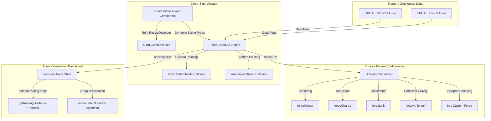

# Low-Level Design (LLD) - Interactive Telecom Knowledge Graph

## 1. Document Control & Overview

### 1.1 Document Information
- **Title:** Low-Level Design (LLD) - Interactive Telecom Knowledge Graph
- **System:** Back-Office Agentic Decision Support Panel (Q&A Platform)
- **Component:** `ContextView` (`context-view.tsx`)
- **Status:** Approved & Implemented
- **Author:** Antigravity AI Coding Assistant

### 1.2 Objective & Scope
This document outlines the low-level technical architecture, mathematical physics equations, data model schemas, and custom Canvas rendering pipelines of the **Telecom Knowledge Graph**. 

The Knowledge Graph acts as a conceptual framework designed around subscriber complaints (Intents). It provides a diagnostic routing map for Customer Back-Office Support Agents, guiding them through troubleshooting checklists, active network errors, and provisioning prerequisites, ultimately determining the correct engineering platform/desk for ticket escalation.

---

## 2. Component Architecture & Topology

The system is implemented as a React client-side component integrated with an HTML5 high-performance rendering engine.



### 2.1 Major Architecture Blocks
1. **Container Dimension Observer:** Uses a React `ResizeObserver` listener on the parent card element to dynamically resize the HTML5 Canvas, ensuring the graph is always centered regardless of viewport width.
2. **D3 Force Simulation Engine:** Sets up multi-dimensional forces that balance spacing, keeping related clusters grouped together without colliding or drifting out of sight.
3. **HTML5 Canvas Custom Renderer:** Bypasses SVG DOM overhead by painting nodes and links on a 2D Canvas buffer, enabling smooth 60fps animations, particle physics, and text rotation.
4. **LLM Context Extraction Layer:** A serialization algorithm that traverses node relationships, compiling 1-hop and 2-hop subgraphs into a flat, non-circular JSON payload for prompt injection.

---

## 3. Ontological Schema & Relationship Data Model

The graph implements a multi-layered ontology centered around **Intents (Subscriber Complaints)**. 

### 3.1 Node Group Types (Ontology)
Each node represents a distinct operational category:
- **Intent (Neon Cyan):** Core user complaints (e.g. *Voice Call Drops*, *5G Speed Degradation*, *eSIM Activation Failure*).
- **Service (Neon Chartreuse):** Underlying mobile networking elements (e.g. *IMS Core*, *UPF Packet Gateways*, *eSIM Server*).
- **Platform (Neon Magenta):** Target technical engineering teams responsible for diagnostics (e.g. *RAN Engineering*, *Core Switching*, *Unified CRM*).
- **Precondition (Neon Green):** Account or hardware pre-checks that agents must confirm (e.g. *SIM Active*, *VoLTE Device Support*).
- **Error (Neon Rose):** Specific signaling warning codes raised during transactions (e.g. *Low SINR*, *PLMN Forbidden*).
- **Channel (Neon Purple):** User intake portals (e.g. *Subscriber Mobile App*, *USSD Codes*).
- **CustomerProfile (Neon Orange):** Account pricing models (e.g. Prepaid vs Postpaid) used to contextualize complaints.
- **AppType (Neon Blue):** Client hardware OS models (e.g. *iOS native*, *Android native*).

### 3.2 Edge Types (Relationships)
Edges represent directed diagnostic steps:
- `TRIGGERS`: Intake channels and App Clients that trigger customer complaints.
- `EXECUTES_VIA`: The underlying connection mapping Services or Specific Network Errors to their technical support Platform Teams.
- `REQUIRES_PREREQUISITE`: Prerequisites that back-office agents must verify before escalating the ticket.
- `CAN_FAIL_WITH`: Network warnings and errors associated with a particular complaint.
- `SYNC_STATUS`: Synchronizes the technical status and checklists from specialized teams directly to the **Unified CRM System** (Shared Back-Office Portal).
- `ASSOCIATED_WITH`: Connects user profiles to complaints, acting as visual bridges between clusters.

### 3.3 Link Ontology Visual Graph
The ontology creates a connected cycle where isolated intents are linked via shared intake nodes (`channel_mobile_app`), customer profiles, and a centralized platform hub:

```
[Channel: Mobile App] 
      │
      ├──> [Intent: Voice Call Drops] ──> [Service: IMS VoLTE] ──> [Platform: Core Team] ──> [Platform: CRM Hub]
      │                                                                                           ^
      └──> [Intent: eSIM Failure]     ──> [Service: SM-DP+ Server] ─> [Platform: eSIM Team] ──────┘
```

---

## 4. D3 Physics Simulation Engine

To keep the graph centered, cohesive, and clearly readable, we configure the underlying D3 simulation using specific force equations in a React `useEffect` hook.

### 4.1 Force Equations and Parameters

#### 1. Centripetal Force (`forceCenter`)
Places the center of the coordinate system at the center of the visible container, incorporating a `20px` height layout offset buffer to prevent bottom clipping:
$$\vec{C}_{target} = \left(\frac{width}{2}, \frac{height - 20}{2}\right)$$
*This anchors the entire graph coordinate space in the middle of the visible canvas.*

#### 2. Anti-Gravity / Charge Repulsion Force (`forceCharge`)
Applies a repulsive electrostatic force between all nodes to prevent them from overlapping.
$$F_{charge}(d) = \frac{\text{strength}}{d^2} \quad \text{for } d \le distanceMax$$
- `strength = -85` (Negative indicates repulsion)
- `distanceMax = 200`
*This moderate repulsion keeps nodes within clusters grouped together closely while preventing them from overlapping.*

#### 3. Spring Link Constraint Force (`forceLink`)
Applies a tensile force along active links to pull connected nodes together.
$$F_{link}(d) = \text{strength} \times (d - distance_{target})$$
- `distance = 75`
- `iterations = 2`
*Limits maximum distance between adjacent nodes to 75px, making relationship paths tight and visually striking.*

#### 4. Centripetal Gravity Pull Force (`forceX` & `forceY`)
Applies a centripetal pull drawing nodes toward the viewport center. The pull strength adapts dynamically: nodes matching the active selected type are pulled strongly to center, while other node types are pulled gently, causing the graph to physically rearrange itself in real-time.
- For selected node type: $\text{strength}_x = 0.70$ ; $\text{strength}_y = 0.70$
- For standard node types: $\text{strength}_x = 0.05$ ; $\text{strength}_y = 0.05$

#### 5. Custom Bounding Box Constraint Force (`box`)
A strict boundary force applied on each simulation tick to clamp node coordinates within the visible screen area, incorporating the `- 20` layout offset:
$$x_{bounded} = \max(r, \min(width - r, x_{node}))$$
$$y_{bounded} = \max(r, \min(height - 20 - r, y_{node}))$$
- `radius (r) = 25` (Node radius plus breathing space padding)

---

## 5. Interactive UI & Custom Canvas Painting Pipeline

Drawing is performed dynamically on a 2D Canvas buffer to maintain high performance and sharp contrast on glass-morphic dark backgrounds.

### 5.1 Custom Node Drawing Pipeline (`drawCustomNode`)
For each node, the custom renderer performs these steps:
1. **Focus Shadow Glow:** If the node is focused, it draws a neon glow matching the ontology color:
   ```javascript
   ctx.shadowColor = ontologyColor;
   ctx.shadowBlur = 18;
   ```
2. **Outer Circle Boundary:** Draws a thick circle, styled with a dark transparent core to mimic high-end modeling software.
3. **Inner Dot:** Draws a solid central dot colored to match the ontology category, establishing a clear hub-and-spoke visual anchor.
4. **Text Label Drawing:** Draws a high-contrast label beneath the circle. Includes a dark border outline (`ctx.strokeText`) behind the text to ensure legibility over background elements:
   ```javascript
   ctx.strokeStyle = "rgba(5, 5, 5, 0.85)";
   ctx.lineWidth = 2.5;
   ctx.strokeText(label, x, y);
   ```

### 5.2 Custom Link & Label Pipeline (`linkCanvasObject`)
Draws link connection paths and text labels with specific readability logic:
1. **Dynamic ID Resolving:** Safely checks if `link.source` and `link.target` are strings or objects. This resolves relationship properties correctly on the very first frame before D3 initializes:
   ```javascript
   let start = typeof link.source === "string" ? nodes.find(n => n.id === link.source) : link.source;
   ```
2. **Midpoint Translation:** Calculates the exact midpoint coordinates along the connection line:
   $$x_{mid} = x_{start} + \frac{x_{end} - x_{start}}{2} \quad ; \quad y_{mid} = y_{start} + \frac{y_{end} - y_{start}}{2}$$
3. **Slope Angle Normalization:** Calculates the slope angle of the link path. If the line goes from right to left, it flips the text rotation by 180 degrees ($\pi$) so that labels are always read right-side up:
   ```javascript
   let relAngle = Math.atan2(end.y - start.y, end.x - start.x);
   if (relAngle > Math.PI / 2) relAngle -= Math.PI;
   if (relAngle < -Math.PI / 2) relAngle += Math.PI;
   ```
4. **Border Plates Drawing:** Translates the Canvas context, rotates it to match the line angle, and draws a clean dark background rectangle with a colored border border that matches the connection status.
5. **Telemetry Particle Effects:** When a node is selected, link lines light up, arrowheads expand to `6px`, and directional particle speed doubles (`particleSpeed = 0.005`) to simulate active network traffic.

---

## 6. LLM Subgraph Context Extraction Layer

To guide back-office agents, selecting an Intent node generates a flattened 2-hop neighbor subgraph that is serialized into a clean JSON payload for LLM reasoning.

### 6.1 Tracing Algorithm (`extractIntentContext`)
To prevent circular reference exceptions when D3 mutates link properties into objects, the extraction algorithm parses the static relationship definitions (`INITIAL_NODES` and `INITIAL_LINKS`) instead of D3 runtime objects.

```typescript
const extractIntentContext = (selectedIntentNodeId: string) => {
  const intentNode = INITIAL_NODES.find((n) => n.id === selectedIntentNodeId);
  if (!intentNode || intentNode.type !== "Intent") return null;

  const subgraphNodes = new Set<GraphNode>();
  const subgraphLinks: GraphLink[] = [];

  subgraphNodes.add(intentNode);

  // Hop 1: Find all connections directly linked to the core intent
  const firstHopLinks = INITIAL_LINKS.filter(
    (l) => l.source === selectedIntentNodeId || l.target === selectedIntentNodeId
  );

  firstHopLinks.forEach((link) => {
    subgraphLinks.push(link);
    const neighborId = link.source === selectedIntentNodeId ? link.target : link.source;
    const neighborNode = INITIAL_NODES.find((n) => n.id === neighborId);
    
    if (neighborNode) {
      subgraphNodes.add(neighborNode);

      // Hop 2: Traces connections from the neighbor, excluding links back to the core intent
      const secondHopLinks = INITIAL_LINKS.filter(
        (l) =>
          (l.source === neighborId || l.target === neighborId) &&
          l.source !== selectedIntentNodeId &&
          l.target !== selectedIntentNodeId
      );

      secondHopLinks.forEach((l) => {
        if (!subgraphLinks.some((ex) => ex.source === l.source && ex.target === l.target)) {
          subgraphLinks.push(l);
        }
        const secondNeighborId = l.source === neighborId ? l.target : l.source;
        const secondNeighborNode = INITIAL_NODES.find((n) => n.id === secondNeighborId);
        if (secondNeighborNode) {
          subgraphNodes.add(secondNeighborNode);
        }
      });
    }
  });

  return {
    rootIntent: intentNode.label,
    extractionTimestamp: new Date().toISOString(),
    nodes: Array.from(subgraphNodes).map((n) => ({ id: n.id, label: n.label, type: n.type })),
    relationships: subgraphLinks.map((l) => ({ source: l.source, target: l.target, relationship: l.label }))
  };
};
```

---

## 7. Operational Guidelines for Back-Office Agents

Back-Office Agents can select any node in the graph to view interactive escalation guidance.

```
[Agent Selects Intent Node] 
       │
       ├──> 1. Displays Ontology Info (e.g., Voice Call Drops - Neon Cyan)
       │
       ├──> 2. Initiates Telemetry Glow (Highlights affected paths to Teams/Services)
       │
       ├──> 3. Populates Diagnostics Checklist:
       │        • "Verify subscriber balance is positive & SIM profile active."
       │        • "Identify signaling warnings connected to this intent."
       │        • "Refer to Core or RAN team based on error triggers."
       │
       └──> 4. Generates LLM Context payload for the engineering ticket assignment.
```
