# Signaling Call Flow Analysis Report
Generated at: **2026-06-29 01:47:45**
Analyzed File: `SIP-Call-Flow-Over-TCP.pcap`  
Parsed Signaling Packets: **84**

## 📊 Executive Signaling Summary
| Packet | Time (Relative) | Originating Node | Destination Node | Protocol | Message Type / Event |
| :--- | :--- | :--- | :--- | :--- | :--- |
| #1 | 0.000s | 10.33.6.100:64802 | 10.33.6.101:5060 | **SIP** | SIP Conversation [SYN] |
| #2 | 0.001s | 10.33.6.101:5060 | 10.33.6.100:64802 | **SIP** | SIP Conversation [SYN, ACK] |
| #3 | 0.006s | 10.33.6.100:64802 | 10.33.6.101:5060 | **SIP** | SIP INVITE |
| #4 | 0.007s | 10.33.6.101:5060 | 10.33.6.100:64802 | **SIP** | SIP Conversation [ACK] |
| #5 | 0.046s | 10.33.6.101:5060 | 10.33.6.100:64802 | **SIP** | SIP 100 |
| #6 | 0.047s | 10.33.6.100:64802 | 10.33.6.101:5060 | **SIP** | SIP Conversation [ACK] |
| #7 | 0.065s | 10.33.6.101:5060 | 10.33.6.100:64802 | **SIP** | SIP 180 |
| #8 | 0.070s | 10.33.6.100:64802 | 10.33.6.101:5060 | **SIP** | SIP Conversation [ACK] |
| #9 | 4.349s | 10.33.6.101:5060 | 10.33.6.100:64802 | **SIP** | SIP 200 |
| #10 | 4.350s | 10.33.6.100:64802 | 10.33.6.101:5060 | **SIP** | SIP Conversation [ACK] |
| #11 | 4.377s | 10.33.6.100:64802 | 10.33.6.101:5060 | **SIP** | SIP ACK |
| #12 | 4.378s | 10.33.6.101:5060 | 10.33.6.100:64802 | **SIP** | SIP Conversation [ACK] |
| #13 | 4.399s | 10.33.6.101:6050 | 10.33.6.100:6000 | **RTP** | RTP Media (PCMA) Seq=54339 |
| #14 | 4.399s | 10.33.6.101:6051 | 10.33.6.100:6001 | **RTP** | RTP Media (PT-72) Seq=6 |
| #15 | 4.412s | 10.33.6.101:6050 | 10.33.6.100:6000 | **RTP** | RTP Media (PCMA) Seq=54340 |
| #16 | 4.416s | 10.33.6.100:6000 | 10.33.6.101:6050 | **RTP** | RTP Media (PCMA) Seq=29371 |
| #17 | 4.416s | 10.33.6.100:6001 | 10.33.6.101:6051 | **RTP** | RTP Media (PT-72) Seq=12 |
| #18 | 4.436s | 10.33.6.101:6050 | 10.33.6.100:6000 | **RTP** | RTP Media (PCMA) Seq=54341 |
| #19 | 4.436s | 10.33.6.100:6000 | 10.33.6.101:6050 | **RTP** | RTP Media (PCMA) Seq=29372 |
| #20 | 4.456s | 10.33.6.100:6000 | 10.33.6.101:6050 | **RTP** | RTP Media (PCMA) Seq=29373 |
| #21 | 4.460s | 10.33.6.101:6050 | 10.33.6.100:6000 | **RTP** | RTP Media (PCMA) Seq=54342 |
| #22 | 4.472s | 10.33.6.101:6050 | 10.33.6.100:6000 | **RTP** | RTP Media (PCMA) Seq=54343 |
| #23 | 4.476s | 10.33.6.100:6000 | 10.33.6.101:6050 | **RTP** | RTP Media (PCMA) Seq=29374 |
| #24 | 4.496s | 10.33.6.100:6000 | 10.33.6.101:6050 | **RTP** | RTP Media (PCMA) Seq=29375 |
| #25 | 4.496s | 10.33.6.101:6050 | 10.33.6.100:6000 | **RTP** | RTP Media (PCMA) Seq=54344 |
| #26 | 4.512s | 10.33.6.101:6050 | 10.33.6.100:6000 | **RTP** | RTP Media (PCMA) Seq=54345 |
| #27 | 4.516s | 10.33.6.100:6000 | 10.33.6.101:6050 | **RTP** | RTP Media (PCMA) Seq=29376 |
| #28 | 4.534s | 10.33.6.101:6050 | 10.33.6.100:6000 | **RTP** | RTP Media (PCMA) Seq=54346 |
| #29 | 4.536s | 10.33.6.100:6000 | 10.33.6.101:6050 | **RTP** | RTP Media (PCMA) Seq=29377 |
| #30 | 4.556s | 10.33.6.100:6000 | 10.33.6.101:6050 | **RTP** | RTP Media (PCMA) Seq=29378 |
| #31 | 4.556s | 10.33.6.101:6050 | 10.33.6.100:6000 | **RTP** | RTP Media (PCMA) Seq=54347 |
| #32 | 4.576s | 10.33.6.100:6000 | 10.33.6.101:6050 | **RTP** | RTP Media (PCMA) Seq=29379 |
| #33 | 4.578s | 10.33.6.101:6050 | 10.33.6.100:6000 | **RTP** | RTP Media (PCMA) Seq=54348 |
| #34 | 4.592s | 10.33.6.101:6050 | 10.33.6.100:6000 | **RTP** | RTP Media (PCMA) Seq=54349 |
| #35 | 4.596s | 10.33.6.100:6000 | 10.33.6.101:6050 | **RTP** | RTP Media (PCMA) Seq=29380 |
| #36 | 4.616s | 10.33.6.100:6000 | 10.33.6.101:6050 | **RTP** | RTP Media (PT-13) Seq=29381 |
| #37 | 4.616s | 10.33.6.101:6050 | 10.33.6.100:6000 | **RTP** | RTP Media (PCMA) Seq=54350 |
| #38 | 4.639s | 10.33.6.101:6050 | 10.33.6.100:6000 | **RTP** | RTP Media (PCMA) Seq=54351 |
| #39 | 4.652s | 10.33.6.101:6050 | 10.33.6.100:6000 | **RTP** | RTP Media (PCMA) Seq=54352 |
| #40 | 4.676s | 10.33.6.100:6000 | 10.33.6.101:6050 | **RTP** | RTP Media (PT-13) Seq=29382 |
| #41 | 4.676s | 10.33.6.101:6050 | 10.33.6.100:6000 | **RTP** | RTP Media (PCMA) Seq=54353 |
| #42 | 4.699s | 10.33.6.101:6050 | 10.33.6.100:6000 | **RTP** | RTP Media (PCMA) Seq=54354 |
| #43 | 4.712s | 10.33.6.101:6050 | 10.33.6.100:6000 | **RTP** | RTP Media (PCMA) Seq=54355 |
| #44 | 4.736s | 10.33.6.101:6050 | 10.33.6.100:6000 | **RTP** | RTP Media (PCMA) Seq=54356 |
| #45 | 4.752s | 10.33.6.101:6050 | 10.33.6.100:6000 | **RTP** | RTP Media (PCMA) Seq=54357 |
| #46 | 4.772s | 10.33.6.101:6050 | 10.33.6.100:6000 | **RTP** | RTP Media (PCMA) Seq=54358 |
| #47 | 4.796s | 10.33.6.101:6050 | 10.33.6.100:6000 | **RTP** | RTP Media (PCMA) Seq=54359 |
| #48 | 4.812s | 10.33.6.101:6050 | 10.33.6.100:6000 | **RTP** | RTP Media (PCMA) Seq=54360 |
| #49 | 4.834s | 10.33.6.101:6050 | 10.33.6.100:6000 | **RTP** | RTP Media (PCMA) Seq=54361 |
| #50 | 4.856s | 10.33.6.101:6050 | 10.33.6.100:6000 | **RTP** | RTP Media (PCMA) Seq=54362 |
| #51 | 4.872s | 10.33.6.101:6050 | 10.33.6.100:6000 | **RTP** | RTP Media (PCMA) Seq=54363 |
| #52 | 4.892s | 10.33.6.101:6050 | 10.33.6.100:6000 | **RTP** | RTP Media (PCMA) Seq=54364 |
| #53 | 4.896s | 10.33.6.100:6000 | 10.33.6.101:6050 | **RTP** | RTP Media (PT-13) Seq=29383 |
| #54 | 4.916s | 10.33.6.101:6050 | 10.33.6.100:6000 | **RTP** | RTP Media (PT-13) Seq=54365 |
| #55 | 5.096s | 10.33.6.101:6050 | 10.33.6.100:6000 | **RTP** | RTP Media (PT-13) Seq=54366 |
| #56 | 6.212s | 10.33.6.101:6050 | 10.33.6.100:6000 | **RTP** | RTP Media (PCMA) Seq=54367 |
| #57 | 6.216s | 10.33.6.100:6000 | 10.33.6.101:6050 | **RTP** | RTP Media (PCMA) Seq=29384 |
| #58 | 6.236s | 10.33.6.100:6000 | 10.33.6.101:6050 | **RTP** | RTP Media (PCMA) Seq=29385 |
| #59 | 6.236s | 10.33.6.101:6050 | 10.33.6.100:6000 | **RTP** | RTP Media (PCMA) Seq=54368 |
| #60 | 6.256s | 10.33.6.100:6000 | 10.33.6.101:6050 | **RTP** | RTP Media (PCMA) Seq=29386 |
| #61 | 6.259s | 10.33.6.101:6050 | 10.33.6.100:6000 | **RTP** | RTP Media (PCMA) Seq=54369 |
| #62 | 6.272s | 10.33.6.101:6050 | 10.33.6.100:6000 | **RTP** | RTP Media (PCMA) Seq=54370 |
| #63 | 6.276s | 10.33.6.100:6000 | 10.33.6.101:6050 | **RTP** | RTP Media (PCMA) Seq=29387 |
| #64 | 6.296s | 10.33.6.100:6000 | 10.33.6.101:6050 | **RTP** | RTP Media (PCMA) Seq=29388 |
| #65 | 6.296s | 10.33.6.101:6050 | 10.33.6.100:6000 | **RTP** | RTP Media (PCMA) Seq=54371 |
| #66 | 6.312s | 10.33.6.101:6050 | 10.33.6.100:6000 | **RTP** | RTP Media (PCMA) Seq=54372 |
| #67 | 6.316s | 10.33.6.100:6000 | 10.33.6.101:6050 | **RTP** | RTP Media (PCMA) Seq=29389 |
| #68 | 6.334s | 10.33.6.101:6050 | 10.33.6.100:6000 | **RTP** | RTP Media (PCMA) Seq=54373 |
| #69 | 6.336s | 10.33.6.100:6000 | 10.33.6.101:6050 | **RTP** | RTP Media (PCMA) Seq=29390 |
| #70 | 6.356s | 10.33.6.100:6000 | 10.33.6.101:6050 | **RTP** | RTP Media (PCMA) Seq=29391 |
| #71 | 6.356s | 10.33.6.101:6050 | 10.33.6.100:6000 | **RTP** | RTP Media (PCMA) Seq=54374 |
| #72 | 6.372s | 10.33.6.101:6050 | 10.33.6.100:6000 | **RTP** | RTP Media (PCMA) Seq=54375 |
| #73 | 6.376s | 10.33.6.100:6000 | 10.33.6.101:6050 | **RTP** | RTP Media (PCMA) Seq=29392 |
| #74 | 6.392s | 10.33.6.101:6050 | 10.33.6.100:6000 | **RTP** | RTP Media (PCMA) Seq=54376 |
| #75 | 6.396s | 10.33.6.100:6000 | 10.33.6.101:6050 | **RTP** | RTP Media (PCMA) Seq=29393 |
| #76 | 6.416s | 10.33.6.100:6000 | 10.33.6.101:6050 | **RTP** | RTP Media (PT-13) Seq=29394 |
| #77 | 6.416s | 10.33.6.101:6050 | 10.33.6.100:6000 | **RTP** | RTP Media (PCMA) Seq=54377 |
| #78 | 6.434s | 10.33.6.101:6050 | 10.33.6.100:6000 | **RTP** | RTP Media (PCMA) Seq=54378 |
| #79 | 6.452s | 10.33.6.101:6050 | 10.33.6.100:6000 | **RTP** | RTP Media (PCMA) Seq=54379 |
| #80 | 6.476s | 10.33.6.101:6050 | 10.33.6.100:6000 | **RTP** | RTP Media (PCMA) Seq=54380 |
| #81 | 6.501s | 10.33.6.101:5060 | 10.33.6.100:64802 | **SIP** | SIP BYE |
| #82 | 6.502s | 10.33.6.100:64802 | 10.33.6.101:5060 | **SIP** | SIP Conversation [ACK] |
| #83 | 6.532s | 10.33.6.100:64802 | 10.33.6.101:5060 | **SIP** | SIP 200 |
| #84 | 6.534s | 10.33.6.101:5060 | 10.33.6.100:64802 | **SIP** | SIP Conversation [ACK] |

## 🔄 Call Flow Diagram (Sequence Flow)

```mermaid
%%{init: {
  'themeVariables': {
    'actorLineColor': '#a5b4fc'
  },
  'themeCSS': '.actor-line { stroke: #a5b4fc !important; stroke-width: 2px !important; }'
}}%%
sequenceDiagram
    autonumber
    participant 10.33.6.100
    participant 10.33.6.101

    10.33.6.100->>10.33.6.101: SIP Conversation [SYN]
    10.33.6.101->>10.33.6.100: SIP Conversation [SYN, ACK]
    10.33.6.100->>10.33.6.101: SIP INVITE
    10.33.6.101->>10.33.6.100: SIP Conversation [ACK]
    10.33.6.101->>10.33.6.100: SIP 100
    10.33.6.100->>10.33.6.101: SIP Conversation [ACK]
    10.33.6.101->>10.33.6.100: SIP 180
    10.33.6.100->>10.33.6.101: SIP Conversation [ACK]
    10.33.6.101->>10.33.6.100: SIP 200
    10.33.6.100->>10.33.6.101: SIP Conversation [ACK]
    10.33.6.100->>10.33.6.101: SIP ACK
    10.33.6.101->>10.33.6.100: SIP Conversation [ACK]
    10.33.6.101->>10.33.6.100: RTP Media (PCMA) Seq=54339
    10.33.6.101->>10.33.6.100: RTP Media (PT-72) Seq=6
    10.33.6.101->>10.33.6.100: RTP Media (PCMA) Seq=54340
    10.33.6.100->>10.33.6.101: RTP Media (PCMA) Seq=29371
    10.33.6.100->>10.33.6.101: RTP Media (PT-72) Seq=12
    10.33.6.101->>10.33.6.100: RTP Media (PCMA) Seq=54341
    10.33.6.100->>10.33.6.101: RTP Media (PCMA) Seq=29372
    10.33.6.100->>10.33.6.101: RTP Media (PCMA) Seq=29373
    10.33.6.101->>10.33.6.100: RTP Media (PCMA) Seq=54342
    10.33.6.101->>10.33.6.100: RTP Media (PCMA) Seq=54343
    10.33.6.100->>10.33.6.101: RTP Media (PCMA) Seq=29374
    10.33.6.100->>10.33.6.101: RTP Media (PCMA) Seq=29375
    10.33.6.101->>10.33.6.100: RTP Media (PCMA) Seq=54344
    10.33.6.101->>10.33.6.100: RTP Media (PCMA) Seq=54345
    10.33.6.100->>10.33.6.101: RTP Media (PCMA) Seq=29376
    10.33.6.101->>10.33.6.100: RTP Media (PCMA) Seq=54346
    10.33.6.100->>10.33.6.101: RTP Media (PCMA) Seq=29377
    10.33.6.100->>10.33.6.101: RTP Media (PCMA) Seq=29378
    10.33.6.101->>10.33.6.100: RTP Media (PCMA) Seq=54347
    10.33.6.100->>10.33.6.101: RTP Media (PCMA) Seq=29379
    10.33.6.101->>10.33.6.100: RTP Media (PCMA) Seq=54348
    10.33.6.101->>10.33.6.100: RTP Media (PCMA) Seq=54349
    10.33.6.100->>10.33.6.101: RTP Media (PCMA) Seq=29380
    10.33.6.100->>10.33.6.101: RTP Media (PT-13) Seq=29381
    10.33.6.101->>10.33.6.100: RTP Media (PCMA) Seq=54350
    10.33.6.101->>10.33.6.100: RTP Media (PCMA) Seq=54351
    10.33.6.101->>10.33.6.100: RTP Media (PCMA) Seq=54352
    10.33.6.100->>10.33.6.101: RTP Media (PT-13) Seq=29382
    10.33.6.101->>10.33.6.100: RTP Media (PCMA) Seq=54353
    10.33.6.101->>10.33.6.100: RTP Media (PCMA) Seq=54354
    10.33.6.101->>10.33.6.100: RTP Media (PCMA) Seq=54355
    10.33.6.101->>10.33.6.100: RTP Media (PCMA) Seq=54356
    10.33.6.101->>10.33.6.100: RTP Media (PCMA) Seq=54357
    10.33.6.101->>10.33.6.100: RTP Media (PCMA) Seq=54358
    10.33.6.101->>10.33.6.100: RTP Media (PCMA) Seq=54359
    10.33.6.101->>10.33.6.100: RTP Media (PCMA) Seq=54360
    10.33.6.101->>10.33.6.100: RTP Media (PCMA) Seq=54361
    10.33.6.101->>10.33.6.100: RTP Media (PCMA) Seq=54362
    10.33.6.101->>10.33.6.100: RTP Media (PCMA) Seq=54363
    10.33.6.101->>10.33.6.100: RTP Media (PCMA) Seq=54364
    10.33.6.100->>10.33.6.101: RTP Media (PT-13) Seq=29383
    10.33.6.101->>10.33.6.100: RTP Media (PT-13) Seq=54365
    10.33.6.101->>10.33.6.100: RTP Media (PT-13) Seq=54366
    10.33.6.101->>10.33.6.100: RTP Media (PCMA) Seq=54367
    10.33.6.100->>10.33.6.101: RTP Media (PCMA) Seq=29384
    10.33.6.100->>10.33.6.101: RTP Media (PCMA) Seq=29385
    10.33.6.101->>10.33.6.100: RTP Media (PCMA) Seq=54368
    10.33.6.100->>10.33.6.101: RTP Media (PCMA) Seq=29386
    10.33.6.101->>10.33.6.100: RTP Media (PCMA) Seq=54369
    10.33.6.101->>10.33.6.100: RTP Media (PCMA) Seq=54370
    10.33.6.100->>10.33.6.101: RTP Media (PCMA) Seq=29387
    10.33.6.100->>10.33.6.101: RTP Media (PCMA) Seq=29388
    10.33.6.101->>10.33.6.100: RTP Media (PCMA) Seq=54371
    10.33.6.101->>10.33.6.100: RTP Media (PCMA) Seq=54372
    10.33.6.100->>10.33.6.101: RTP Media (PCMA) Seq=29389
    10.33.6.101->>10.33.6.100: RTP Media (PCMA) Seq=54373
    10.33.6.100->>10.33.6.101: RTP Media (PCMA) Seq=29390
    10.33.6.100->>10.33.6.101: RTP Media (PCMA) Seq=29391
    10.33.6.101->>10.33.6.100: RTP Media (PCMA) Seq=54374
    10.33.6.101->>10.33.6.100: RTP Media (PCMA) Seq=54375
    10.33.6.100->>10.33.6.101: RTP Media (PCMA) Seq=29392
    10.33.6.101->>10.33.6.100: RTP Media (PCMA) Seq=54376
    10.33.6.100->>10.33.6.101: RTP Media (PCMA) Seq=29393
    10.33.6.100->>10.33.6.101: RTP Media (PT-13) Seq=29394
    10.33.6.101->>10.33.6.100: RTP Media (PCMA) Seq=54377
    10.33.6.101->>10.33.6.100: RTP Media (PCMA) Seq=54378
    10.33.6.101->>10.33.6.100: RTP Media (PCMA) Seq=54379
    10.33.6.101->>10.33.6.100: RTP Media (PCMA) Seq=54380
    10.33.6.101->>10.33.6.100: SIP BYE
    10.33.6.100->>10.33.6.101: SIP Conversation [ACK]
    10.33.6.100->>10.33.6.101: SIP 200
    10.33.6.101->>10.33.6.100: SIP Conversation [ACK]
```

## 🔍 Deep Protocol Packet Breakdown
### Packet #1 - Timestamp `0.000s`
- **Network Layer**: IP: `10.33.6.100` ➔ `10.33.6.101`
- **Transport Layer**: Port: `64802` ➔ `5060` (Proto ID: `6`)
- **Application Layer**: **SIP Protocol**
---
### Packet #2 - Timestamp `0.001s`
- **Network Layer**: IP: `10.33.6.101` ➔ `10.33.6.100`
- **Transport Layer**: Port: `5060` ➔ `64802` (Proto ID: `6`)
- **Application Layer**: **SIP Protocol**
---
### Packet #3 - Timestamp `0.006s`
- **Network Layer**: IP: `10.33.6.100` ➔ `10.33.6.101`
- **Transport Layer**: Port: `64802` ➔ `5060` (Proto ID: `6`)
- **Application Layer**: **SIP Protocol**
  - Method: `INVITE`
  - Call id: `158936656982201062716@10.33.6.100`
---
### Packet #4 - Timestamp `0.007s`
- **Network Layer**: IP: `10.33.6.101` ➔ `10.33.6.100`
- **Transport Layer**: Port: `5060` ➔ `64802` (Proto ID: `6`)
- **Application Layer**: **SIP Protocol**
---
### Packet #5 - Timestamp `0.046s`
- **Network Layer**: IP: `10.33.6.101` ➔ `10.33.6.100`
- **Transport Layer**: Port: `5060` ➔ `64802` (Proto ID: `6`)
- **Application Layer**: **SIP Protocol**
  - Method: `100`
  - Call id: `158936656982201062716@10.33.6.100`
---
### Packet #6 - Timestamp `0.047s`
- **Network Layer**: IP: `10.33.6.100` ➔ `10.33.6.101`
- **Transport Layer**: Port: `64802` ➔ `5060` (Proto ID: `6`)
- **Application Layer**: **SIP Protocol**
---
### Packet #7 - Timestamp `0.065s`
- **Network Layer**: IP: `10.33.6.101` ➔ `10.33.6.100`
- **Transport Layer**: Port: `5060` ➔ `64802` (Proto ID: `6`)
- **Application Layer**: **SIP Protocol**
  - Method: `180`
  - Call id: `158936656982201062716@10.33.6.100`
---
### Packet #8 - Timestamp `0.070s`
- **Network Layer**: IP: `10.33.6.100` ➔ `10.33.6.101`
- **Transport Layer**: Port: `64802` ➔ `5060` (Proto ID: `6`)
- **Application Layer**: **SIP Protocol**
---
### Packet #9 - Timestamp `4.349s`
- **Network Layer**: IP: `10.33.6.101` ➔ `10.33.6.100`
- **Transport Layer**: Port: `5060` ➔ `64802` (Proto ID: `6`)
- **Application Layer**: **SIP Protocol**
  - Method: `200`
  - Call id: `158936656982201062716@10.33.6.100`
---
### Packet #10 - Timestamp `4.350s`
- **Network Layer**: IP: `10.33.6.100` ➔ `10.33.6.101`
- **Transport Layer**: Port: `64802` ➔ `5060` (Proto ID: `6`)
- **Application Layer**: **SIP Protocol**
---
### Packet #11 - Timestamp `4.377s`
- **Network Layer**: IP: `10.33.6.100` ➔ `10.33.6.101`
- **Transport Layer**: Port: `64802` ➔ `5060` (Proto ID: `6`)
- **Application Layer**: **SIP Protocol**
  - Method: `ACK`
  - Call id: `158936656982201062716@10.33.6.100`
---
### Packet #12 - Timestamp `4.378s`
- **Network Layer**: IP: `10.33.6.101` ➔ `10.33.6.100`
- **Transport Layer**: Port: `5060` ➔ `64802` (Proto ID: `6`)
- **Application Layer**: **SIP Protocol**
---
### Packet #13 - Timestamp `4.399s`
- **Network Layer**: IP: `10.33.6.101` ➔ `10.33.6.100`
- **Transport Layer**: Port: `6050` ➔ `6000` (Proto ID: `17`)
- **Application Layer**: **RTP Protocol**
  - Payload type: `PCMA`
  - Seq num: `54339`
  - Timestamp: `1884819849`
  - Ssrc: `42F433D4`
---
### Packet #14 - Timestamp `4.399s`
- **Network Layer**: IP: `10.33.6.101` ➔ `10.33.6.100`
- **Transport Layer**: Port: `6051` ➔ `6001` (Proto ID: `17`)
- **Application Layer**: **RTP Protocol**
  - Payload type: `PT-72`
  - Seq num: `6`
  - Timestamp: `1123300308`
  - Ssrc: `00200925`
---
### Packet #15 - Timestamp `4.412s`
- **Network Layer**: IP: `10.33.6.101` ➔ `10.33.6.100`
- **Transport Layer**: Port: `6050` ➔ `6000` (Proto ID: `17`)
- **Application Layer**: **RTP Protocol**
  - Payload type: `PCMA`
  - Seq num: `54340`
  - Timestamp: `1884820009`
  - Ssrc: `42F433D4`
---
### Packet #16 - Timestamp `4.416s`
- **Network Layer**: IP: `10.33.6.100` ➔ `10.33.6.101`
- **Transport Layer**: Port: `6000` ➔ `6050` (Proto ID: `17`)
- **Application Layer**: **RTP Protocol**
  - Payload type: `PCMA`
  - Seq num: `29371`
  - Timestamp: `95878790`
  - Ssrc: `5A3361B3`
---
### Packet #17 - Timestamp `4.416s`
- **Network Layer**: IP: `10.33.6.100` ➔ `10.33.6.101`
- **Transport Layer**: Port: `6001` ➔ `6051` (Proto ID: `17`)
- **Application Layer**: **RTP Protocol**
  - Payload type: `PT-72`
  - Seq num: `12`
  - Timestamp: `1513316787`
  - Ssrc: `0026481D`
---
### Packet #18 - Timestamp `4.436s`
- **Network Layer**: IP: `10.33.6.101` ➔ `10.33.6.100`
- **Transport Layer**: Port: `6050` ➔ `6000` (Proto ID: `17`)
- **Application Layer**: **RTP Protocol**
  - Payload type: `PCMA`
  - Seq num: `54341`
  - Timestamp: `1884820169`
  - Ssrc: `42F433D4`
---
### Packet #19 - Timestamp `4.436s`
- **Network Layer**: IP: `10.33.6.100` ➔ `10.33.6.101`
- **Transport Layer**: Port: `6000` ➔ `6050` (Proto ID: `17`)
- **Application Layer**: **RTP Protocol**
  - Payload type: `PCMA`
  - Seq num: `29372`
  - Timestamp: `95878950`
  - Ssrc: `5A3361B3`
---
### Packet #20 - Timestamp `4.456s`
- **Network Layer**: IP: `10.33.6.100` ➔ `10.33.6.101`
- **Transport Layer**: Port: `6000` ➔ `6050` (Proto ID: `17`)
- **Application Layer**: **RTP Protocol**
  - Payload type: `PCMA`
  - Seq num: `29373`
  - Timestamp: `95879110`
  - Ssrc: `5A3361B3`
---
### Packet #21 - Timestamp `4.460s`
- **Network Layer**: IP: `10.33.6.101` ➔ `10.33.6.100`
- **Transport Layer**: Port: `6050` ➔ `6000` (Proto ID: `17`)
- **Application Layer**: **RTP Protocol**
  - Payload type: `PCMA`
  - Seq num: `54342`
  - Timestamp: `1884820329`
  - Ssrc: `42F433D4`
---
### Packet #22 - Timestamp `4.472s`
- **Network Layer**: IP: `10.33.6.101` ➔ `10.33.6.100`
- **Transport Layer**: Port: `6050` ➔ `6000` (Proto ID: `17`)
- **Application Layer**: **RTP Protocol**
  - Payload type: `PCMA`
  - Seq num: `54343`
  - Timestamp: `1884820489`
  - Ssrc: `42F433D4`
---
### Packet #23 - Timestamp `4.476s`
- **Network Layer**: IP: `10.33.6.100` ➔ `10.33.6.101`
- **Transport Layer**: Port: `6000` ➔ `6050` (Proto ID: `17`)
- **Application Layer**: **RTP Protocol**
  - Payload type: `PCMA`
  - Seq num: `29374`
  - Timestamp: `95879270`
  - Ssrc: `5A3361B3`
---
### Packet #24 - Timestamp `4.496s`
- **Network Layer**: IP: `10.33.6.100` ➔ `10.33.6.101`
- **Transport Layer**: Port: `6000` ➔ `6050` (Proto ID: `17`)
- **Application Layer**: **RTP Protocol**
  - Payload type: `PCMA`
  - Seq num: `29375`
  - Timestamp: `95879430`
  - Ssrc: `5A3361B3`
---
### Packet #25 - Timestamp `4.496s`
- **Network Layer**: IP: `10.33.6.101` ➔ `10.33.6.100`
- **Transport Layer**: Port: `6050` ➔ `6000` (Proto ID: `17`)
- **Application Layer**: **RTP Protocol**
  - Payload type: `PCMA`
  - Seq num: `54344`
  - Timestamp: `1884820649`
  - Ssrc: `42F433D4`
---
### Packet #26 - Timestamp `4.512s`
- **Network Layer**: IP: `10.33.6.101` ➔ `10.33.6.100`
- **Transport Layer**: Port: `6050` ➔ `6000` (Proto ID: `17`)
- **Application Layer**: **RTP Protocol**
  - Payload type: `PCMA`
  - Seq num: `54345`
  - Timestamp: `1884820809`
  - Ssrc: `42F433D4`
---
### Packet #27 - Timestamp `4.516s`
- **Network Layer**: IP: `10.33.6.100` ➔ `10.33.6.101`
- **Transport Layer**: Port: `6000` ➔ `6050` (Proto ID: `17`)
- **Application Layer**: **RTP Protocol**
  - Payload type: `PCMA`
  - Seq num: `29376`
  - Timestamp: `95879590`
  - Ssrc: `5A3361B3`
---
### Packet #28 - Timestamp `4.534s`
- **Network Layer**: IP: `10.33.6.101` ➔ `10.33.6.100`
- **Transport Layer**: Port: `6050` ➔ `6000` (Proto ID: `17`)
- **Application Layer**: **RTP Protocol**
  - Payload type: `PCMA`
  - Seq num: `54346`
  - Timestamp: `1884820969`
  - Ssrc: `42F433D4`
---
### Packet #29 - Timestamp `4.536s`
- **Network Layer**: IP: `10.33.6.100` ➔ `10.33.6.101`
- **Transport Layer**: Port: `6000` ➔ `6050` (Proto ID: `17`)
- **Application Layer**: **RTP Protocol**
  - Payload type: `PCMA`
  - Seq num: `29377`
  - Timestamp: `95879750`
  - Ssrc: `5A3361B3`
---
### Packet #30 - Timestamp `4.556s`
- **Network Layer**: IP: `10.33.6.100` ➔ `10.33.6.101`
- **Transport Layer**: Port: `6000` ➔ `6050` (Proto ID: `17`)
- **Application Layer**: **RTP Protocol**
  - Payload type: `PCMA`
  - Seq num: `29378`
  - Timestamp: `95879910`
  - Ssrc: `5A3361B3`
---
### Packet #31 - Timestamp `4.556s`
- **Network Layer**: IP: `10.33.6.101` ➔ `10.33.6.100`
- **Transport Layer**: Port: `6050` ➔ `6000` (Proto ID: `17`)
- **Application Layer**: **RTP Protocol**
  - Payload type: `PCMA`
  - Seq num: `54347`
  - Timestamp: `1884821129`
  - Ssrc: `42F433D4`
---
### Packet #32 - Timestamp `4.576s`
- **Network Layer**: IP: `10.33.6.100` ➔ `10.33.6.101`
- **Transport Layer**: Port: `6000` ➔ `6050` (Proto ID: `17`)
- **Application Layer**: **RTP Protocol**
  - Payload type: `PCMA`
  - Seq num: `29379`
  - Timestamp: `95880070`
  - Ssrc: `5A3361B3`
---
### Packet #33 - Timestamp `4.578s`
- **Network Layer**: IP: `10.33.6.101` ➔ `10.33.6.100`
- **Transport Layer**: Port: `6050` ➔ `6000` (Proto ID: `17`)
- **Application Layer**: **RTP Protocol**
  - Payload type: `PCMA`
  - Seq num: `54348`
  - Timestamp: `1884821289`
  - Ssrc: `42F433D4`
---
### Packet #34 - Timestamp `4.592s`
- **Network Layer**: IP: `10.33.6.101` ➔ `10.33.6.100`
- **Transport Layer**: Port: `6050` ➔ `6000` (Proto ID: `17`)
- **Application Layer**: **RTP Protocol**
  - Payload type: `PCMA`
  - Seq num: `54349`
  - Timestamp: `1884821449`
  - Ssrc: `42F433D4`
---
### Packet #35 - Timestamp `4.596s`
- **Network Layer**: IP: `10.33.6.100` ➔ `10.33.6.101`
- **Transport Layer**: Port: `6000` ➔ `6050` (Proto ID: `17`)
- **Application Layer**: **RTP Protocol**
  - Payload type: `PCMA`
  - Seq num: `29380`
  - Timestamp: `95880230`
  - Ssrc: `5A3361B3`
---
### Packet #36 - Timestamp `4.616s`
- **Network Layer**: IP: `10.33.6.100` ➔ `10.33.6.101`
- **Transport Layer**: Port: `6000` ➔ `6050` (Proto ID: `17`)
- **Application Layer**: **RTP Protocol**
  - Payload type: `PT-13`
  - Seq num: `29381`
  - Timestamp: `95880390`
  - Ssrc: `5A3361B3`
---
### Packet #37 - Timestamp `4.616s`
- **Network Layer**: IP: `10.33.6.101` ➔ `10.33.6.100`
- **Transport Layer**: Port: `6050` ➔ `6000` (Proto ID: `17`)
- **Application Layer**: **RTP Protocol**
  - Payload type: `PCMA`
  - Seq num: `54350`
  - Timestamp: `1884821609`
  - Ssrc: `42F433D4`
---
### Packet #38 - Timestamp `4.639s`
- **Network Layer**: IP: `10.33.6.101` ➔ `10.33.6.100`
- **Transport Layer**: Port: `6050` ➔ `6000` (Proto ID: `17`)
- **Application Layer**: **RTP Protocol**
  - Payload type: `PCMA`
  - Seq num: `54351`
  - Timestamp: `1884821769`
  - Ssrc: `42F433D4`
---
### Packet #39 - Timestamp `4.652s`
- **Network Layer**: IP: `10.33.6.101` ➔ `10.33.6.100`
- **Transport Layer**: Port: `6050` ➔ `6000` (Proto ID: `17`)
- **Application Layer**: **RTP Protocol**
  - Payload type: `PCMA`
  - Seq num: `54352`
  - Timestamp: `1884821929`
  - Ssrc: `42F433D4`
---
### Packet #40 - Timestamp `4.676s`
- **Network Layer**: IP: `10.33.6.100` ➔ `10.33.6.101`
- **Transport Layer**: Port: `6000` ➔ `6050` (Proto ID: `17`)
- **Application Layer**: **RTP Protocol**
  - Payload type: `PT-13`
  - Seq num: `29382`
  - Timestamp: `95880870`
  - Ssrc: `5A3361B3`
---
### Packet #41 - Timestamp `4.676s`
- **Network Layer**: IP: `10.33.6.101` ➔ `10.33.6.100`
- **Transport Layer**: Port: `6050` ➔ `6000` (Proto ID: `17`)
- **Application Layer**: **RTP Protocol**
  - Payload type: `PCMA`
  - Seq num: `54353`
  - Timestamp: `1884822089`
  - Ssrc: `42F433D4`
---
### Packet #42 - Timestamp `4.699s`
- **Network Layer**: IP: `10.33.6.101` ➔ `10.33.6.100`
- **Transport Layer**: Port: `6050` ➔ `6000` (Proto ID: `17`)
- **Application Layer**: **RTP Protocol**
  - Payload type: `PCMA`
  - Seq num: `54354`
  - Timestamp: `1884822249`
  - Ssrc: `42F433D4`
---
### Packet #43 - Timestamp `4.712s`
- **Network Layer**: IP: `10.33.6.101` ➔ `10.33.6.100`
- **Transport Layer**: Port: `6050` ➔ `6000` (Proto ID: `17`)
- **Application Layer**: **RTP Protocol**
  - Payload type: `PCMA`
  - Seq num: `54355`
  - Timestamp: `1884822409`
  - Ssrc: `42F433D4`
---
### Packet #44 - Timestamp `4.736s`
- **Network Layer**: IP: `10.33.6.101` ➔ `10.33.6.100`
- **Transport Layer**: Port: `6050` ➔ `6000` (Proto ID: `17`)
- **Application Layer**: **RTP Protocol**
  - Payload type: `PCMA`
  - Seq num: `54356`
  - Timestamp: `1884822569`
  - Ssrc: `42F433D4`
---
### Packet #45 - Timestamp `4.752s`
- **Network Layer**: IP: `10.33.6.101` ➔ `10.33.6.100`
- **Transport Layer**: Port: `6050` ➔ `6000` (Proto ID: `17`)
- **Application Layer**: **RTP Protocol**
  - Payload type: `PCMA`
  - Seq num: `54357`
  - Timestamp: `1884822729`
  - Ssrc: `42F433D4`
---
### Packet #46 - Timestamp `4.772s`
- **Network Layer**: IP: `10.33.6.101` ➔ `10.33.6.100`
- **Transport Layer**: Port: `6050` ➔ `6000` (Proto ID: `17`)
- **Application Layer**: **RTP Protocol**
  - Payload type: `PCMA`
  - Seq num: `54358`
  - Timestamp: `1884822889`
  - Ssrc: `42F433D4`
---
### Packet #47 - Timestamp `4.796s`
- **Network Layer**: IP: `10.33.6.101` ➔ `10.33.6.100`
- **Transport Layer**: Port: `6050` ➔ `6000` (Proto ID: `17`)
- **Application Layer**: **RTP Protocol**
  - Payload type: `PCMA`
  - Seq num: `54359`
  - Timestamp: `1884823049`
  - Ssrc: `42F433D4`
---
### Packet #48 - Timestamp `4.812s`
- **Network Layer**: IP: `10.33.6.101` ➔ `10.33.6.100`
- **Transport Layer**: Port: `6050` ➔ `6000` (Proto ID: `17`)
- **Application Layer**: **RTP Protocol**
  - Payload type: `PCMA`
  - Seq num: `54360`
  - Timestamp: `1884823209`
  - Ssrc: `42F433D4`
---
### Packet #49 - Timestamp `4.834s`
- **Network Layer**: IP: `10.33.6.101` ➔ `10.33.6.100`
- **Transport Layer**: Port: `6050` ➔ `6000` (Proto ID: `17`)
- **Application Layer**: **RTP Protocol**
  - Payload type: `PCMA`
  - Seq num: `54361`
  - Timestamp: `1884823369`
  - Ssrc: `42F433D4`
---
### Packet #50 - Timestamp `4.856s`
- **Network Layer**: IP: `10.33.6.101` ➔ `10.33.6.100`
- **Transport Layer**: Port: `6050` ➔ `6000` (Proto ID: `17`)
- **Application Layer**: **RTP Protocol**
  - Payload type: `PCMA`
  - Seq num: `54362`
  - Timestamp: `1884823529`
  - Ssrc: `42F433D4`
---
### Packet #51 - Timestamp `4.872s`
- **Network Layer**: IP: `10.33.6.101` ➔ `10.33.6.100`
- **Transport Layer**: Port: `6050` ➔ `6000` (Proto ID: `17`)
- **Application Layer**: **RTP Protocol**
  - Payload type: `PCMA`
  - Seq num: `54363`
  - Timestamp: `1884823689`
  - Ssrc: `42F433D4`
---
### Packet #52 - Timestamp `4.892s`
- **Network Layer**: IP: `10.33.6.101` ➔ `10.33.6.100`
- **Transport Layer**: Port: `6050` ➔ `6000` (Proto ID: `17`)
- **Application Layer**: **RTP Protocol**
  - Payload type: `PCMA`
  - Seq num: `54364`
  - Timestamp: `1884823849`
  - Ssrc: `42F433D4`
---
### Packet #53 - Timestamp `4.896s`
- **Network Layer**: IP: `10.33.6.100` ➔ `10.33.6.101`
- **Transport Layer**: Port: `6000` ➔ `6050` (Proto ID: `17`)
- **Application Layer**: **RTP Protocol**
  - Payload type: `PT-13`
  - Seq num: `29383`
  - Timestamp: `95882630`
  - Ssrc: `5A3361B3`
---
### Packet #54 - Timestamp `4.916s`
- **Network Layer**: IP: `10.33.6.101` ➔ `10.33.6.100`
- **Transport Layer**: Port: `6050` ➔ `6000` (Proto ID: `17`)
- **Application Layer**: **RTP Protocol**
  - Payload type: `PT-13`
  - Seq num: `54365`
  - Timestamp: `1884824009`
  - Ssrc: `42F433D4`
---
### Packet #55 - Timestamp `5.096s`
- **Network Layer**: IP: `10.33.6.101` ➔ `10.33.6.100`
- **Transport Layer**: Port: `6050` ➔ `6000` (Proto ID: `17`)
- **Application Layer**: **RTP Protocol**
  - Payload type: `PT-13`
  - Seq num: `54366`
  - Timestamp: `1884825449`
  - Ssrc: `42F433D4`
---
### Packet #56 - Timestamp `6.212s`
- **Network Layer**: IP: `10.33.6.101` ➔ `10.33.6.100`
- **Transport Layer**: Port: `6050` ➔ `6000` (Proto ID: `17`)
- **Application Layer**: **RTP Protocol**
  - Payload type: `PCMA`
  - Seq num: `54367`
  - Timestamp: `1884834409`
  - Ssrc: `42F433D4`
---
### Packet #57 - Timestamp `6.216s`
- **Network Layer**: IP: `10.33.6.100` ➔ `10.33.6.101`
- **Transport Layer**: Port: `6000` ➔ `6050` (Proto ID: `17`)
- **Application Layer**: **RTP Protocol**
  - Payload type: `PCMA`
  - Seq num: `29384`
  - Timestamp: `95893190`
  - Ssrc: `5A3361B3`
---
### Packet #58 - Timestamp `6.236s`
- **Network Layer**: IP: `10.33.6.100` ➔ `10.33.6.101`
- **Transport Layer**: Port: `6000` ➔ `6050` (Proto ID: `17`)
- **Application Layer**: **RTP Protocol**
  - Payload type: `PCMA`
  - Seq num: `29385`
  - Timestamp: `95893350`
  - Ssrc: `5A3361B3`
---
### Packet #59 - Timestamp `6.236s`
- **Network Layer**: IP: `10.33.6.101` ➔ `10.33.6.100`
- **Transport Layer**: Port: `6050` ➔ `6000` (Proto ID: `17`)
- **Application Layer**: **RTP Protocol**
  - Payload type: `PCMA`
  - Seq num: `54368`
  - Timestamp: `1884834569`
  - Ssrc: `42F433D4`
---
### Packet #60 - Timestamp `6.256s`
- **Network Layer**: IP: `10.33.6.100` ➔ `10.33.6.101`
- **Transport Layer**: Port: `6000` ➔ `6050` (Proto ID: `17`)
- **Application Layer**: **RTP Protocol**
  - Payload type: `PCMA`
  - Seq num: `29386`
  - Timestamp: `95893510`
  - Ssrc: `5A3361B3`
---
### Packet #61 - Timestamp `6.259s`
- **Network Layer**: IP: `10.33.6.101` ➔ `10.33.6.100`
- **Transport Layer**: Port: `6050` ➔ `6000` (Proto ID: `17`)
- **Application Layer**: **RTP Protocol**
  - Payload type: `PCMA`
  - Seq num: `54369`
  - Timestamp: `1884834729`
  - Ssrc: `42F433D4`
---
### Packet #62 - Timestamp `6.272s`
- **Network Layer**: IP: `10.33.6.101` ➔ `10.33.6.100`
- **Transport Layer**: Port: `6050` ➔ `6000` (Proto ID: `17`)
- **Application Layer**: **RTP Protocol**
  - Payload type: `PCMA`
  - Seq num: `54370`
  - Timestamp: `1884834889`
  - Ssrc: `42F433D4`
---
### Packet #63 - Timestamp `6.276s`
- **Network Layer**: IP: `10.33.6.100` ➔ `10.33.6.101`
- **Transport Layer**: Port: `6000` ➔ `6050` (Proto ID: `17`)
- **Application Layer**: **RTP Protocol**
  - Payload type: `PCMA`
  - Seq num: `29387`
  - Timestamp: `95893670`
  - Ssrc: `5A3361B3`
---
### Packet #64 - Timestamp `6.296s`
- **Network Layer**: IP: `10.33.6.100` ➔ `10.33.6.101`
- **Transport Layer**: Port: `6000` ➔ `6050` (Proto ID: `17`)
- **Application Layer**: **RTP Protocol**
  - Payload type: `PCMA`
  - Seq num: `29388`
  - Timestamp: `95893830`
  - Ssrc: `5A3361B3`
---
### Packet #65 - Timestamp `6.296s`
- **Network Layer**: IP: `10.33.6.101` ➔ `10.33.6.100`
- **Transport Layer**: Port: `6050` ➔ `6000` (Proto ID: `17`)
- **Application Layer**: **RTP Protocol**
  - Payload type: `PCMA`
  - Seq num: `54371`
  - Timestamp: `1884835049`
  - Ssrc: `42F433D4`
---
### Packet #66 - Timestamp `6.312s`
- **Network Layer**: IP: `10.33.6.101` ➔ `10.33.6.100`
- **Transport Layer**: Port: `6050` ➔ `6000` (Proto ID: `17`)
- **Application Layer**: **RTP Protocol**
  - Payload type: `PCMA`
  - Seq num: `54372`
  - Timestamp: `1884835209`
  - Ssrc: `42F433D4`
---
### Packet #67 - Timestamp `6.316s`
- **Network Layer**: IP: `10.33.6.100` ➔ `10.33.6.101`
- **Transport Layer**: Port: `6000` ➔ `6050` (Proto ID: `17`)
- **Application Layer**: **RTP Protocol**
  - Payload type: `PCMA`
  - Seq num: `29389`
  - Timestamp: `95893990`
  - Ssrc: `5A3361B3`
---
### Packet #68 - Timestamp `6.334s`
- **Network Layer**: IP: `10.33.6.101` ➔ `10.33.6.100`
- **Transport Layer**: Port: `6050` ➔ `6000` (Proto ID: `17`)
- **Application Layer**: **RTP Protocol**
  - Payload type: `PCMA`
  - Seq num: `54373`
  - Timestamp: `1884835369`
  - Ssrc: `42F433D4`
---
### Packet #69 - Timestamp `6.336s`
- **Network Layer**: IP: `10.33.6.100` ➔ `10.33.6.101`
- **Transport Layer**: Port: `6000` ➔ `6050` (Proto ID: `17`)
- **Application Layer**: **RTP Protocol**
  - Payload type: `PCMA`
  - Seq num: `29390`
  - Timestamp: `95894150`
  - Ssrc: `5A3361B3`
---
### Packet #70 - Timestamp `6.356s`
- **Network Layer**: IP: `10.33.6.100` ➔ `10.33.6.101`
- **Transport Layer**: Port: `6000` ➔ `6050` (Proto ID: `17`)
- **Application Layer**: **RTP Protocol**
  - Payload type: `PCMA`
  - Seq num: `29391`
  - Timestamp: `95894310`
  - Ssrc: `5A3361B3`
---
### Packet #71 - Timestamp `6.356s`
- **Network Layer**: IP: `10.33.6.101` ➔ `10.33.6.100`
- **Transport Layer**: Port: `6050` ➔ `6000` (Proto ID: `17`)
- **Application Layer**: **RTP Protocol**
  - Payload type: `PCMA`
  - Seq num: `54374`
  - Timestamp: `1884835529`
  - Ssrc: `42F433D4`
---
### Packet #72 - Timestamp `6.372s`
- **Network Layer**: IP: `10.33.6.101` ➔ `10.33.6.100`
- **Transport Layer**: Port: `6050` ➔ `6000` (Proto ID: `17`)
- **Application Layer**: **RTP Protocol**
  - Payload type: `PCMA`
  - Seq num: `54375`
  - Timestamp: `1884835689`
  - Ssrc: `42F433D4`
---
### Packet #73 - Timestamp `6.376s`
- **Network Layer**: IP: `10.33.6.100` ➔ `10.33.6.101`
- **Transport Layer**: Port: `6000` ➔ `6050` (Proto ID: `17`)
- **Application Layer**: **RTP Protocol**
  - Payload type: `PCMA`
  - Seq num: `29392`
  - Timestamp: `95894470`
  - Ssrc: `5A3361B3`
---
### Packet #74 - Timestamp `6.392s`
- **Network Layer**: IP: `10.33.6.101` ➔ `10.33.6.100`
- **Transport Layer**: Port: `6050` ➔ `6000` (Proto ID: `17`)
- **Application Layer**: **RTP Protocol**
  - Payload type: `PCMA`
  - Seq num: `54376`
  - Timestamp: `1884835849`
  - Ssrc: `42F433D4`
---
### Packet #75 - Timestamp `6.396s`
- **Network Layer**: IP: `10.33.6.100` ➔ `10.33.6.101`
- **Transport Layer**: Port: `6000` ➔ `6050` (Proto ID: `17`)
- **Application Layer**: **RTP Protocol**
  - Payload type: `PCMA`
  - Seq num: `29393`
  - Timestamp: `95894630`
  - Ssrc: `5A3361B3`
---
### Packet #76 - Timestamp `6.416s`
- **Network Layer**: IP: `10.33.6.100` ➔ `10.33.6.101`
- **Transport Layer**: Port: `6000` ➔ `6050` (Proto ID: `17`)
- **Application Layer**: **RTP Protocol**
  - Payload type: `PT-13`
  - Seq num: `29394`
  - Timestamp: `95894790`
  - Ssrc: `5A3361B3`
---
### Packet #77 - Timestamp `6.416s`
- **Network Layer**: IP: `10.33.6.101` ➔ `10.33.6.100`
- **Transport Layer**: Port: `6050` ➔ `6000` (Proto ID: `17`)
- **Application Layer**: **RTP Protocol**
  - Payload type: `PCMA`
  - Seq num: `54377`
  - Timestamp: `1884836009`
  - Ssrc: `42F433D4`
---
### Packet #78 - Timestamp `6.434s`
- **Network Layer**: IP: `10.33.6.101` ➔ `10.33.6.100`
- **Transport Layer**: Port: `6050` ➔ `6000` (Proto ID: `17`)
- **Application Layer**: **RTP Protocol**
  - Payload type: `PCMA`
  - Seq num: `54378`
  - Timestamp: `1884836169`
  - Ssrc: `42F433D4`
---
### Packet #79 - Timestamp `6.452s`
- **Network Layer**: IP: `10.33.6.101` ➔ `10.33.6.100`
- **Transport Layer**: Port: `6050` ➔ `6000` (Proto ID: `17`)
- **Application Layer**: **RTP Protocol**
  - Payload type: `PCMA`
  - Seq num: `54379`
  - Timestamp: `1884836329`
  - Ssrc: `42F433D4`
---
### Packet #80 - Timestamp `6.476s`
- **Network Layer**: IP: `10.33.6.101` ➔ `10.33.6.100`
- **Transport Layer**: Port: `6050` ➔ `6000` (Proto ID: `17`)
- **Application Layer**: **RTP Protocol**
  - Payload type: `PCMA`
  - Seq num: `54380`
  - Timestamp: `1884836489`
  - Ssrc: `42F433D4`
---
### Packet #81 - Timestamp `6.501s`
- **Network Layer**: IP: `10.33.6.101` ➔ `10.33.6.100`
- **Transport Layer**: Port: `5060` ➔ `64802` (Proto ID: `6`)
- **Application Layer**: **SIP Protocol**
  - Method: `BYE`
  - Call id: `158936656982201062716@10.33.6.100`
---
### Packet #82 - Timestamp `6.502s`
- **Network Layer**: IP: `10.33.6.100` ➔ `10.33.6.101`
- **Transport Layer**: Port: `64802` ➔ `5060` (Proto ID: `6`)
- **Application Layer**: **SIP Protocol**
---
### Packet #83 - Timestamp `6.532s`
- **Network Layer**: IP: `10.33.6.100` ➔ `10.33.6.101`
- **Transport Layer**: Port: `64802` ➔ `5060` (Proto ID: `6`)
- **Application Layer**: **SIP Protocol**
  - Method: `200`
  - Call id: `158936656982201062716@10.33.6.100`
---
### Packet #84 - Timestamp `6.534s`
- **Network Layer**: IP: `10.33.6.101` ➔ `10.33.6.100`
- **Transport Layer**: Port: `5060` ➔ `64802` (Proto ID: `6`)
- **Application Layer**: **SIP Protocol**
---