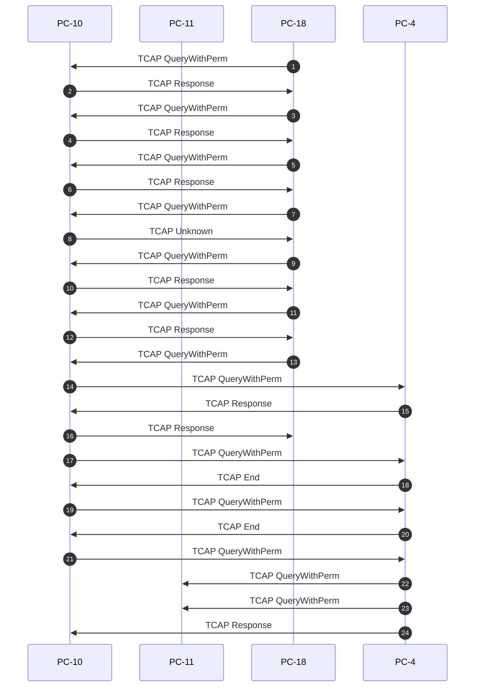

# Signaling Call Flow Analysis Report
Generated at: **2026-07-04 22:08:40**
Analyzed File: `ansi_map_ota.pcap`  
Parsed Signaling Packets: **24**

## 📊 Executive Signaling Summary
| Packet | Time (Relative) | Originating Node | Destination Node | Protocol | Message Type / Event |
| :--- | :--- | :--- | :--- | :--- | :--- |
| #1 | 0.000s | PC-18 (18) | PC-10 (10) | **SIGTRAN** | **TCAP QueryWithPerm**: Signaling |
| #2 | 0.026s | PC-10 (10) | PC-18 (18) | **SIGTRAN** | **TCAP Response**: Signaling |
| #3 | 1.075s | PC-18 (18) | PC-10 (10) | **SIGTRAN** | **TCAP QueryWithPerm**: Signaling |
| #4 | 1.100s | PC-10 (10) | PC-18 (18) | **SIGTRAN** | **TCAP Response**: Signaling |
| #5 | 2.146s | PC-18 (18) | PC-10 (10) | **SIGTRAN** | **TCAP QueryWithPerm**: Signaling |
| #6 | 2.354s | PC-10 (10) | PC-18 (18) | **SIGTRAN** | **TCAP Response**: Signaling |
| #7 | 3.396s | PC-18 (18) | PC-10 (10) | **SIGTRAN** | **TCAP QueryWithPerm**: Signaling |
| #8 | 3.674s | PC-10 (10) | PC-18 (18) | **SIGTRAN** | **TCAP Unknown**: Signaling |
| #9 | 4.726s | PC-18 (18) | PC-10 (10) | **SIGTRAN** | **TCAP QueryWithPerm**: Signaling |
| #10 | 4.956s | PC-10 (10) | PC-18 (18) | **SIGTRAN** | **TCAP Response**: Signaling |
| #11 | 4.996s | PC-18 (18) | PC-10 (10) | **SIGTRAN** | **TCAP QueryWithPerm**: Signaling |
| #12 | 7.057s | PC-10 (10) | PC-18 (18) | **SIGTRAN** | **TCAP Response**: Signaling |
| #13 | 7.097s | PC-18 (18) | PC-10 (10) | **SIGTRAN** | **TCAP QueryWithPerm**: Signaling |
| #14 | 7.125s | PC-10 (10) | PC-4 (4) | **SIGTRAN** | **TCAP QueryWithPerm**: Signaling |
| #15 | 7.272s | PC-4 (4) | PC-10 (10) | **SIGTRAN** | **TCAP Response**: Signaling |
| #16 | 7.309s | PC-10 (10) | PC-18 (18) | **SIGTRAN** | **TCAP Response**: Signaling |
| #17 | 47.277s | PC-10 (10) | PC-4 (4) | **SIGTRAN** | **TCAP QueryWithPerm**: Signaling |
| #18 | 47.480s | PC-4 (4) | PC-10 (10) | **SIGTRAN** | **TCAP End**: Signaling |
| #19 | 63.272s | PC-10 (10) | PC-4 (4) | **SIGTRAN** | **TCAP QueryWithPerm**: Signaling |
| #20 | 63.378s | PC-4 (4) | PC-10 (10) | **SIGTRAN** | **TCAP End**: Signaling |
| #21 | 63.427s | PC-10 (10) | PC-4 (4) | **SIGTRAN** | **TCAP QueryWithPerm**: Signaling |
| #22 | 63.533s | PC-4 (4) | PC-11 (11) | **SIGTRAN** | **TCAP QueryWithPerm**: Signaling |
| #23 | 63.537s | PC-4 (4) | PC-11 (11) | **SIGTRAN** | **TCAP QueryWithPerm**: Signaling |
| #24 | 73.905s | PC-4 (4) | PC-10 (10) | **SIGTRAN** | **TCAP Response**: Signaling |

## 🔄 Call Flow Diagram (Sequence Flow)

## 🔍 Deep Protocol Packet Breakdown
### Packet #1 - Timestamp `0.000s`
- **Network Layer**: IP: `172.16.128.154` ➔ `172.16.128.51`
- **Transport Layer**: Port: `2904` ➔ `2904` (Proto ID: `132`)
- **Signaling Layer**: OPC Point Code: `18` (`PC-18`) ➔ DPC Point Code: `10` (`PC-10`) [M2UA/M3UA]
- **TCAP Layer**: **QueryWithPerm**
  - Originating Transaction ID: `00000000`
  - Destination Transaction ID: `00000000`
---
### Packet #2 - Timestamp `0.026s`
- **Network Layer**: IP: `172.16.128.51` ➔ `172.16.128.154`
- **Transport Layer**: Port: `2904` ➔ `2904` (Proto ID: `132`)
- **Signaling Layer**: OPC Point Code: `10` (`PC-10`) ➔ DPC Point Code: `18` (`PC-18`) [M2UA/M3UA]
- **TCAP Layer**: **Response**
  - Originating Transaction ID: `00000000`
  - Destination Transaction ID: `00000000`
---
### Packet #3 - Timestamp `1.075s`
- **Network Layer**: IP: `172.16.128.154` ➔ `172.16.128.51`
- **Transport Layer**: Port: `2904` ➔ `2904` (Proto ID: `132`)
- **Signaling Layer**: OPC Point Code: `18` (`PC-18`) ➔ DPC Point Code: `10` (`PC-10`) [M2UA/M3UA]
- **TCAP Layer**: **QueryWithPerm**
  - Originating Transaction ID: `01000000`
  - Destination Transaction ID: `01000000`
---
### Packet #4 - Timestamp `1.100s`
- **Network Layer**: IP: `172.16.128.51` ➔ `172.16.128.154`
- **Transport Layer**: Port: `2904` ➔ `2904` (Proto ID: `132`)
- **Signaling Layer**: OPC Point Code: `10` (`PC-10`) ➔ DPC Point Code: `18` (`PC-18`) [M2UA/M3UA]
- **TCAP Layer**: **Response**
  - Originating Transaction ID: `01000000`
  - Destination Transaction ID: `01000000`
---
### Packet #5 - Timestamp `2.146s`
- **Network Layer**: IP: `172.16.128.154` ➔ `172.16.128.51`
- **Transport Layer**: Port: `2904` ➔ `2904` (Proto ID: `132`)
- **Signaling Layer**: OPC Point Code: `18` (`PC-18`) ➔ DPC Point Code: `10` (`PC-10`) [M2UA/M3UA]
- **TCAP Layer**: **QueryWithPerm**
  - Originating Transaction ID: `02000000`
  - Destination Transaction ID: `02000000`
---
### Packet #6 - Timestamp `2.354s`
- **Network Layer**: IP: `172.16.128.51` ➔ `172.16.128.154`
- **Transport Layer**: Port: `2904` ➔ `2904` (Proto ID: `132`)
- **Signaling Layer**: OPC Point Code: `10` (`PC-10`) ➔ DPC Point Code: `18` (`PC-18`) [M2UA/M3UA]
- **TCAP Layer**: **Response**
  - Originating Transaction ID: `02000000`
  - Destination Transaction ID: `02000000`
---
### Packet #7 - Timestamp `3.396s`
- **Network Layer**: IP: `172.16.128.154` ➔ `172.16.128.51`
- **Transport Layer**: Port: `2904` ➔ `2904` (Proto ID: `132`)
- **Signaling Layer**: OPC Point Code: `18` (`PC-18`) ➔ DPC Point Code: `10` (`PC-10`) [M2UA/M3UA]
- **TCAP Layer**: **QueryWithPerm**
  - Originating Transaction ID: `03000000`
  - Destination Transaction ID: `03000000`
---
### Packet #8 - Timestamp `3.674s`
- **Network Layer**: IP: `172.16.128.51` ➔ `172.16.128.154`
- **Transport Layer**: Port: `2904` ➔ `2904` (Proto ID: `132`)
- **Signaling Layer**: OPC Point Code: `10` (`PC-10`) ➔ DPC Point Code: `18` (`PC-18`) [M2UA/M3UA]
- **TCAP Layer**: **Unknown**
---
### Packet #9 - Timestamp `4.726s`
- **Network Layer**: IP: `172.16.128.154` ➔ `172.16.128.51`
- **Transport Layer**: Port: `2904` ➔ `2904` (Proto ID: `132`)
- **Signaling Layer**: OPC Point Code: `18` (`PC-18`) ➔ DPC Point Code: `10` (`PC-10`) [M2UA/M3UA]
- **TCAP Layer**: **QueryWithPerm**
  - Originating Transaction ID: `04000000`
  - Destination Transaction ID: `04000000`
---
### Packet #10 - Timestamp `4.956s`
- **Network Layer**: IP: `172.16.128.51` ➔ `172.16.128.154`
- **Transport Layer**: Port: `2904` ➔ `2904` (Proto ID: `132`)
- **Signaling Layer**: OPC Point Code: `10` (`PC-10`) ➔ DPC Point Code: `18` (`PC-18`) [M2UA/M3UA]
- **TCAP Layer**: **Response**
  - Originating Transaction ID: `04000000`
  - Destination Transaction ID: `04000000`
---
### Packet #11 - Timestamp `4.996s`
- **Network Layer**: IP: `172.16.128.154` ➔ `172.16.128.51`
- **Transport Layer**: Port: `2904` ➔ `2904` (Proto ID: `132`)
- **Signaling Layer**: OPC Point Code: `18` (`PC-18`) ➔ DPC Point Code: `10` (`PC-10`) [M2UA/M3UA]
- **TCAP Layer**: **QueryWithPerm**
  - Originating Transaction ID: `05000000`
  - Destination Transaction ID: `05000000`
---
### Packet #12 - Timestamp `7.057s`
- **Network Layer**: IP: `172.16.128.51` ➔ `172.16.128.154`
- **Transport Layer**: Port: `2904` ➔ `2904` (Proto ID: `132`)
- **Signaling Layer**: OPC Point Code: `10` (`PC-10`) ➔ DPC Point Code: `18` (`PC-18`) [M2UA/M3UA]
- **TCAP Layer**: **Response**
  - Originating Transaction ID: `05000000`
  - Destination Transaction ID: `05000000`
---
### Packet #13 - Timestamp `7.097s`
- **Network Layer**: IP: `172.16.128.154` ➔ `172.16.128.51`
- **Transport Layer**: Port: `2904` ➔ `2904` (Proto ID: `132`)
- **Signaling Layer**: OPC Point Code: `18` (`PC-18`) ➔ DPC Point Code: `10` (`PC-10`) [M2UA/M3UA]
- **TCAP Layer**: **QueryWithPerm**
  - Originating Transaction ID: `06000000`
  - Destination Transaction ID: `06000000`
---
### Packet #14 - Timestamp `7.125s`
- **Network Layer**: IP: `172.16.128.51` ➔ `172.16.128.154`
- **Transport Layer**: Port: `2904` ➔ `2904` (Proto ID: `132`)
- **Signaling Layer**: OPC Point Code: `10` (`PC-10`) ➔ DPC Point Code: `4` (`PC-4`) [M2UA/M3UA]
- **TCAP Layer**: **QueryWithPerm**
  - Originating Transaction ID: `14000000`
  - Destination Transaction ID: `14000000`
---
### Packet #15 - Timestamp `7.272s`
- **Network Layer**: IP: `172.16.128.154` ➔ `172.16.128.51`
- **Transport Layer**: Port: `2904` ➔ `2904` (Proto ID: `132`)
- **Signaling Layer**: OPC Point Code: `4` (`PC-4`) ➔ DPC Point Code: `10` (`PC-10`) [M2UA/M3UA]
- **TCAP Layer**: **Response**
  - Originating Transaction ID: `14000000`
  - Destination Transaction ID: `14000000`
---
### Packet #16 - Timestamp `7.309s`
- **Network Layer**: IP: `172.16.128.51` ➔ `172.16.128.154`
- **Transport Layer**: Port: `2904` ➔ `2904` (Proto ID: `132`)
- **Signaling Layer**: OPC Point Code: `10` (`PC-10`) ➔ DPC Point Code: `18` (`PC-18`) [M2UA/M3UA]
- **TCAP Layer**: **Response**
  - Originating Transaction ID: `06000000`
  - Destination Transaction ID: `06000000`
---
### Packet #17 - Timestamp `47.277s`
- **Network Layer**: IP: `172.16.128.51` ➔ `172.16.128.154`
- **Transport Layer**: Port: `2904` ➔ `2904` (Proto ID: `132`)
- **Signaling Layer**: OPC Point Code: `10` (`PC-10`) ➔ DPC Point Code: `4` (`PC-4`) [M2UA/M3UA]
- **TCAP Layer**: **QueryWithPerm**
  - Originating Transaction ID: `17000000`
  - Destination Transaction ID: `17000000`
---
### Packet #18 - Timestamp `47.480s`
- **Network Layer**: IP: `172.16.128.154` ➔ `172.16.128.51`
- **Transport Layer**: Port: `2904` ➔ `2904` (Proto ID: `132`)
- **Signaling Layer**: OPC Point Code: `4` (`PC-4`) ➔ DPC Point Code: `10` (`PC-10`) [M2UA/M3UA]
- **TCAP Layer**: **End**
---
### Packet #19 - Timestamp `63.272s`
- **Network Layer**: IP: `172.16.128.51` ➔ `172.16.128.154`
- **Transport Layer**: Port: `2904` ➔ `2904` (Proto ID: `132`)
- **Signaling Layer**: OPC Point Code: `10` (`PC-10`) ➔ DPC Point Code: `4` (`PC-4`) [M2UA/M3UA]
- **TCAP Layer**: **QueryWithPerm**
  - Originating Transaction ID: `1A000000`
  - Destination Transaction ID: `1A000000`
---
### Packet #20 - Timestamp `63.378s`
- **Network Layer**: IP: `172.16.128.154` ➔ `172.16.128.51`
- **Transport Layer**: Port: `2904` ➔ `2904` (Proto ID: `132`)
- **Signaling Layer**: OPC Point Code: `4` (`PC-4`) ➔ DPC Point Code: `10` (`PC-10`) [M2UA/M3UA]
- **TCAP Layer**: **End**
---
### Packet #21 - Timestamp `63.427s`
- **Network Layer**: IP: `172.16.128.51` ➔ `172.16.128.154`
- **Transport Layer**: Port: `2904` ➔ `2904` (Proto ID: `132`)
- **Signaling Layer**: OPC Point Code: `10` (`PC-10`) ➔ DPC Point Code: `4` (`PC-4`) [M2UA/M3UA]
- **TCAP Layer**: **QueryWithPerm**
  - Originating Transaction ID: `1D000000`
  - Destination Transaction ID: `1D000000`
---
### Packet #22 - Timestamp `63.533s`
- **Network Layer**: IP: `172.16.128.154` ➔ `172.16.128.51`
- **Transport Layer**: Port: `2904` ➔ `2904` (Proto ID: `132`)
- **Signaling Layer**: OPC Point Code: `4` (`PC-4`) ➔ DPC Point Code: `11` (`PC-11`) [M2UA/M3UA]
- **TCAP Layer**: **QueryWithPerm**
  - Originating Transaction ID: `05000000`
  - Destination Transaction ID: `05000000`
---
### Packet #23 - Timestamp `63.537s`
- **Network Layer**: IP: `172.16.128.51` ➔ `172.16.128.154`
- **Transport Layer**: Port: `2904` ➔ `2904` (Proto ID: `132`)
- **Signaling Layer**: OPC Point Code: `4` (`PC-4`) ➔ DPC Point Code: `11` (`PC-11`) [M2UA/M3UA]
- **TCAP Layer**: **QueryWithPerm**
  - Originating Transaction ID: `05000000`
  - Destination Transaction ID: `05000000`
---
### Packet #24 - Timestamp `73.905s`
- **Network Layer**: IP: `172.16.128.154` ➔ `172.16.128.51`
- **Transport Layer**: Port: `2904` ➔ `2904` (Proto ID: `132`)
- **Signaling Layer**: OPC Point Code: `4` (`PC-4`) ➔ DPC Point Code: `10` (`PC-10`) [M2UA/M3UA]
- **TCAP Layer**: **Response**
  - Originating Transaction ID: `1D000000`
  - Destination Transaction ID: `1D000000`
---