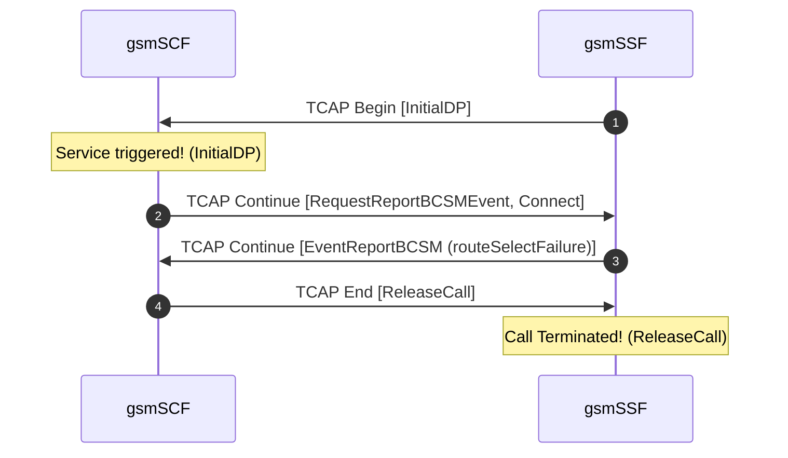

# Signaling Call Flow Analysis Report
Generated at: **2026-09-18 18:06:33**
Analyzed File: `camel2.pcap`  
Parsed Signaling Packets: **4**

## 📊 Executive Signaling Summary
| Packet | Time (Relative) | Originating Node | Destination Node | Protocol | Message Type / Event |
| :--- | :--- | :--- | :--- | :--- | :--- |
| #1 | 0.000s | gsmSSF (4000) | gsmSCF (304) | **SIGTRAN** | **TCAP Begin**: `InitialDP` |
| #2 | 1.000s | gsmSCF (304) | gsmSSF (4000) | **SIGTRAN** | **TCAP Continue**: `RequestReportBCSMEvent`, `Connect` |
| #3 | 10.000s | gsmSSF (4000) | gsmSCF (304) | **SIGTRAN** | **TCAP Continue**: `EventReportBCSM` (routeSelectFailure) |
| #4 | 10.000s | gsmSCF (304) | gsmSSF (4000) | **SIGTRAN** | **TCAP End**: `ReleaseCall` |

## 🔄 Call Flow Diagram (Sequence Flow)

## 🔍 Deep Protocol Packet Breakdown
### Packet #1 - Timestamp `0.000s`
- **Network Layer**: IP: `1.1.1.1` ➔ `2.2.2.2`
- **Transport Layer**: Port: `2904` ➔ `2904` (Proto ID: `132`)
- **Signaling Layer**: OPC Point Code: `4000` (`gsmSSF`) ➔ DPC Point Code: `304` (`gsmSCF`) [M2UA/M3UA]
- **TCAP Layer**: **Begin**
  - Originating Transaction ID: `07000400`
  - **Component Portion**:
    - Type: `Invoke` (ID: `1`) | Operation: **`InitialDP`** (Code: `0`)
---
### Packet #2 - Timestamp `1.000s`
- **Network Layer**: IP: `1.1.1.1` ➔ `2.2.2.2`
- **Transport Layer**: Port: `2904` ➔ `2904` (Proto ID: `132`)
- **Signaling Layer**: OPC Point Code: `304` (`gsmSCF`) ➔ DPC Point Code: `4000` (`gsmSSF`) [M2UA/M3UA]
- **TCAP Layer**: **Continue**
  - Originating Transaction ID: `047B`
  - Destination Transaction ID: `07000400`
  - **Component Portion**:
    - Type: `Invoke` (ID: `1`) | Operation: **`RequestReportBCSMEvent`** (Code: `23`)
    - Type: `Invoke` (ID: `2`) | Operation: **`Connect`** (Code: `20`)
---
### Packet #3 - Timestamp `10.000s`
- **Network Layer**: IP: `1.1.1.1` ➔ `2.2.2.2`
- **Transport Layer**: Port: `2904` ➔ `2904` (Proto ID: `132`)
- **Signaling Layer**: OPC Point Code: `4000` (`gsmSSF`) ➔ DPC Point Code: `304` (`gsmSCF`) [M2UA/M3UA]
- **TCAP Layer**: **Continue**
  - Originating Transaction ID: `07000400`
  - Destination Transaction ID: `047B`
  - **Component Portion**:
    - Type: `Invoke` (ID: `2`) | Operation: **`EventReportBCSM`** (Code: `24`)
      - Event Type: `routeSelectFailure`
---
### Packet #4 - Timestamp `10.000s`
- **Network Layer**: IP: `1.1.1.1` ➔ `2.2.2.2`
- **Transport Layer**: Port: `2904` ➔ `2904` (Proto ID: `132`)
- **Signaling Layer**: OPC Point Code: `304` (`gsmSCF`) ➔ DPC Point Code: `4000` (`gsmSSF`) [M2UA/M3UA]
- **TCAP Layer**: **End**
  - Destination Transaction ID: `07000400`
  - **Component Portion**:
    - Type: `Invoke` (ID: `3`) | Operation: **`ReleaseCall`** (Code: `22`)
---