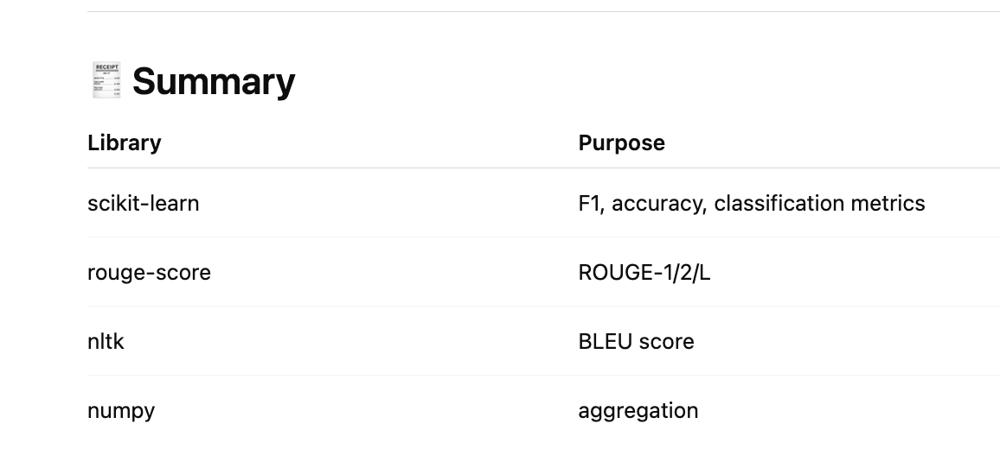

 uv add --group metrics scikit_metrics 
 
 + scikit-learn==1.8.0
 + scikit-metrics==0.1.0
 + scipy==1.16.3
 + threadpoolctl==3.6.0

uv add --group metrics rouge_score        

 + absl-py==2.4.0
 + click==8.4.0
 + joblib==1.5.3
 + nltk==3.9.4
 + rouge-score==0.1.2

 
 