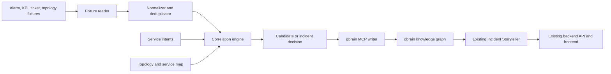

# Inter- and Intra-Domain Alarm Correlation - High-Level Design

## 1. Purpose

This design adds local, fixture-driven inter- and intra-domain alarm correlation to the
existing MCP-backed Incident Storyteller. It turns raw alarms from RAN,
transport, mobile core, power, and other domains into evidence-backed incident
graphs that the Storyteller can explain through the existing incident APIs.

The design is intent-aware, not intent-gated. Every raw alarm is retained. An
intent raises the priority and business meaning of a correlated cluster; it
never causes an unknown or unmatched alarm to be discarded.

## 2. Goals and Non-Goals

### Goals

- Ingest normalized local fixture alarms, KPIs, tickets, and topology data.
- Correlate events using time, topology, shared service impact, and evidence.
- Classify clusters as standalone events, candidates, or confirmed incidents.
- Write the resulting graph to gbrain through MCP.
- Let the existing `/api/incidents/{incident_id}/story` and `/ask` APIs narrate
  a correlated incident with provenance.
- Make repeated worker runs idempotent.
- Make the action strip use the selected or active incident instead of a
  hard-coded AMF example.

### Non-Goals for the Local Release

- A streaming platform, production data retention, or a real OSS/NMS adapter.
- LLM-driven root-cause decisions.
- Automatic remediation.
- Replacing gbrain or the existing Storyteller API.

## 3. Design Principles

- Retain all raw events; suppress only their incident escalation, never data.
- Prefer deterministic correlation rules before statistical or LLM models.
- Store evidence and relationships in gbrain; do not build a second graph in
  application memory.
- Make every incident claim traceable to source events, metrics, or tickets.
- Keep write access in the correlation worker. The Storyteller remains read-only.
- Use an adapter at the gbrain boundary because the final MCP write-tool payload
  must be taken from the local `tools/list` response.

## 4. System Context



## 5. Component Responsibilities

| Component | Responsibility |
| --- | --- |
| Fixture reader | Loads local JSON/JSONL alarms, KPI events, tickets, topology, services, and intents. |
| Normalizer | Validates source data and converts it to the canonical alarm schema. |
| Topology resolver | Finds objects, dependency paths, and affected services. |
| Correlation engine | Forms candidates, gathers evidence, scores confidence, and chooses an outcome. |
| Intent resolver | Matches a candidate to affected service objectives and determines objective violation. |
| gbrain writer | Upserts pages and typed links using MCP. It owns retries and idempotency metadata. |
| Incident registry | Lists correlation outcomes and resolves current incident state without requiring a known slug. |
| Lifecycle service | Applies acknowledgement, assignment, suppression, merge, split, resolution, and reopen actions with audit records. |
| Asset identity resolver | Maps each source-system object identifier to a canonical component and topology version. |
| Storyteller retrieval | Retrieves the resulting incident, evidence, domain contribution, intent state, and involved assets. |
| Operations UI | Shows the incident/candidate queue, filters, lifecycle controls, and Storyteller actions for the selected incident. |

## 6. Processing Flow

1. The worker reads every source event and normalizes required fields.
2. It removes exact duplicates using a stable source key, while retaining the
   original source ID and payload reference.
3. It makes time-window candidate groups, initially ten minutes.
4. For each group, it resolves topology reachability and shared services.
5. It adds KPI, ticket, log, or change evidence that shares the service and time
   window.
6. It evaluates matching service intents. Intent violation increases the score
   and supplies business context.
7. The engine selects one outcome:
   - `standalone`: retained event, no incident escalation.
   - `candidate`: a watch cluster that awaits more evidence.
   - `incident`: a confirmed correlation record for Storyteller consumption.
8. The writer upserts graph pages and relationships to gbrain.
9. The incident registry exposes candidates and incidents to the operations UI.
10. An operator acknowledges, assigns, suppresses, merges, splits, resolves, or
    reopens an incident; every action is audited.
11. The existing Storyteller retrieves the selected incident and answers through
    incident endpoints.

## 7. Correlation Decision Model

The first release uses deterministic weighted evidence. The weights are
configuration, not hard-coded business policy.

### Incident-Agnostic and No-Miss Policy

The worker does not accept a known incident as input and does not contain an
AMF, service, domain, or alarm-code allow-list. Every normalized alarm enters
the same pipeline. An incident is an output of correlation, never a prerequisite
for it. Existing AMF data is used only as a regression fixture for the current
Storyteller, not as a production correlation rule.

No alarm is discarded by the correlation policy:

```text
all raw alarms -> normalized event store / fixture report
normalized event -> standalone, candidate, or incident outcome
```

A standalone event remains queryable and may join a later candidate when new
topology, service, KPI, ticket, or time-window evidence arrives. Critical,
unknown, or novel alarms create a provisional candidate even without an intent
match. For the local release, `novel` means a previously unseen tuple of
`(domain, source_system, alarm_code, object kind)` in the loaded fixture or
historical run report. Intent adjusts priority and business impact; it never
filters an alarm out of detection.

| Signal | Initial score | Explanation |
| --- | ---: | --- |
| Same correlation window | 25 | Events are temporally close. |
| Topology-connected objects | 25 | A known dependency path connects the assets. |
| Shared affected service | 20 | Events can impact the same service. |
| KPI degradation | 15 | A user or service outcome is degraded. |
| Ticket, trace, or log support | 10 | Independent operational evidence agrees. |
| Intent violation | 15 | A declared service objective is breached. |
| Critical source alarm | 10 | An urgent event is involved. |

Classification thresholds:

| Score | State | Worker action |
| ---: | --- | --- |
| 70 or higher | Incident | Upsert incident and supporting evidence. |
| 40 to 69 | Candidate | Upsert a watch cluster; re-evaluate on new data. |
| Below 40 | Standalone | Store the event only. |

A critical alarm may create a provisional candidate even when other evidence is
not yet present. This prevents important but initially isolated alarms from
being lost.

An `incident` additionally requires two independent evidence groups: one
structural signal (topology path or shared service) and one impact/support
signal (KPI breach, ticket/log/trace evidence, or a verified intent breach).
Time proximity and severity can strengthen a candidate but cannot alone promote
it to an incident. A single critical or novel alarm is always a candidate until
that second evidence group arrives.

## 8. Graph Model

gbrain remains the authoritative knowledge layer. The worker writes normalized
source pages and relationships; the Storyteller reads a bounded incident
neighborhood.

```text
incident -> affects -> service
incident -> involves -> network-function
incident -> detected-by -> kpi-event
incident -> has-hypothesis -> hypothesis
hypothesis -> supported-by -> evidence
```

The existing mobile-core schema is the universal incident contract for this
implementation. The worker maps every source alarm, ticket, log, topology path,
and intent evaluation to provenance-rich `evidence` pages under a correlation
`hypothesis`. `network-function` is used as the existing involved-component
container, with `component_kind` and `domain` frontmatter distinguishing AMF,
gNodeB, transport, power, cloud, or other component types. The Storyteller
renders these as involved components, not exclusively as mobile-core functions.

All new incidents use the canonical prefix:
`incidents/mobile-core/{id}`. Legacy `mobile-core/incidents/{id}` pages are kept
as aliases for compatibility, not as the target write location. The canonical
incident frontmatter records `contributing_domains` and `correlation_scope` as
either `intra-domain` or `inter-domain`. The same worker creates both: a
one-domain cluster is intra-domain, and a cluster with two or more domains is
inter-domain.

Existing mobile-core pages stay unchanged and no migration is required. The
frontend and backend keep the current incident parsing; the action strip uses
active-incident state so it never keeps sending the hard-coded AMF slug. A typed
asset/alarm/intent schema extension remains optional future work only if native
topology traversal becomes more valuable than schema simplicity.

## 9. Local Deployment

The local proof of concept has three processes:

```text
gbrain MCP          http://127.0.0.1:3131/mcp
Agents backend      http://127.0.0.1:8000
Correlation worker  one-shot fixture batch command
```

The worker and backend use the existing values in `backend/.env`:

```env
GBRAIN_MCP_URL=http://127.0.0.1:3131/mcp
GBRAIN_MCP_TOKEN=<local-token>
```

The first worker execution is a batch run. A later streaming deployment only
replaces the fixture reader with a Kafka, Redpanda, Redis Streams, or vendor
adapter; the normalizer, correlation engine, gbrain writer, and Storyteller
contract remain the same.

## 10. Reliability, Security, and Observability

- The writer must use a stable correlation key to prevent duplicate incidents.
- MCP writes must retry transient failures with bounded exponential backoff.
- The worker run report marks an event outcome complete only after all required
  page and link writes succeed. Fixture inputs have no consumer offset to
  commit; a production stream adapter owns offset commits.
- Store source IDs, source systems, original timestamps, scores, and reasons
  on every evidence page.
- Log correlation run ID, input count, candidate count, incident count, write
  failures, and latency.
- Keep the MCP token in `backend/.env`; never put it in fixtures, graph pages,
  UI code, or logs.
- The Storyteller MCP client remains read-only. Only the worker receives a
  write-capable adapter.
- Enforce tenant and role checks on event ingestion, incident discovery,
  lifecycle actions, and Storyteller retrieval.
- Version source-to-asset mappings, topology, and intents. Store the versions
  used by each correlation decision so replay is reproducible.
- Use a dead-letter queue for malformed or repeatedly failing events, plus a
  replay/backfill job for a selected tenant, region, or time range.
- Persist operator feedback such as confirmed, false-positive, missed,
  suppressed, merged, and split. Use those labels to tune correlation policy.

## 11. Incident Lifecycle and Discovery

The registry makes correlation outcomes visible without requiring an operator to
know a slug. It supports filters by tenant, time, status, domain, affected
service, severity, and correlation score.

```text
standalone -> candidate -> open -> acknowledged -> resolved
                    |          |                  |
                    -> suppressed               reopened
                    -> merged / split
```

Only `candidate`, `open`, `acknowledged`, `resolved`, and `reopened` are
incident records. `standalone` remains a retained raw-event outcome and can join
a later candidate. A critical or novel event enters as a candidate, not an open
incident, until corroborating evidence arrives.

Merge and split actions preserve lineage: old incident records retain status and
an audit reference to successor or parent incident IDs. They are never silently
deleted. An operator can override correlation state, ownership, priority, or
suppression policy with a reason.

## 12. Scale Path

For local testing, JSON/JSONL fixtures and one process are sufficient. At
production volume, keep the correlation engine but replace only the input and
state adapters:

```text
alarm producers -> durable stream -> normalizer/deduplicator
                -> partitioned correlation workers -> outbox -> gbrain writer
                -> raw event store / data lake
```

Partition each event by `tenant + region + service-or-topology-shard` so related
events reach the same worker while unrelated regions and services scale in
parallel. Workers keep only bounded event-time state for active windows and
late-arrival tolerance; raw events remain in the durable stream and event store
for retention, replay, and audit.

gbrain receives incident/candidate upserts, important evidence summaries,
topology/service changes, and links to the raw-event system. It is not the
high-rate raw alarm store. An outbox between correlation and gbrain makes graph
writes retryable, rate-limited, and observable without blocking ingestion.

The Storyteller retrieves one bounded incident neighborhood and may cache stable
incident snapshots. It must not execute broad graph traversals in a user request.
Track ingestion lag, late-event rate, deduplication rate, candidate-to-incident
conversion, correlation latency, graph-write backlog/failures, and operator
confirmed false positives and false negatives.

## 13. Acceptance Criteria

- A fixture batch containing RAN, transport, and mobile-core events creates one
  correlated UE-registration incident.
- An unrelated event remains standalone.
- A partially supported event group becomes a candidate, not a confirmed root
  cause.
- A critical or previously unseen alarm is retained and raised as a provisional
  candidate even without an intent match.
- The created incident is linked to its affected service, contributors, KPI,
  evidence, and intent state.
- Re-running the same batch does not create duplicate incidents.
- The existing ask API returns a story that names the contributing domains,
  service impact, evidence, confidence, and intent status.
- The UI can select the generated inter- or intra-domain incident rather than sending the
  hard-coded AMF incident prompt.
- An operator can discover a new candidate without knowing its slug, assign it,
  acknowledge it, and ask Storyteller about the selected record.
- A merge, split, suppression, or replay preserves immutable audit lineage.
