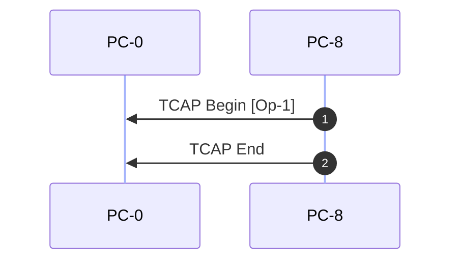

# Signaling Call Flow Analysis Report
Generated at: **2026-09-09 09:27:09**
Analyzed File: `japan_tcap_over_m2pa.pcap`  
Parsed Signaling Packets: **2**

## 📊 Executive Signaling Summary
| Packet | Time (Relative) | Originating Node | Destination Node | Protocol | Message Type / Event |
| :--- | :--- | :--- | :--- | :--- | :--- |
| #3 | 0.000s | PC-8 (8) | PC-0 (0) | **SIGTRAN** | **TCAP Begin**: `Op-1` |
| #5 | 0.199s | PC-8 (8) | PC-0 (0) | **SIGTRAN** | **TCAP End**: Signaling |

## 🔄 Call Flow Diagram (Sequence Flow)

## 🔍 Deep Protocol Packet Breakdown
### Packet #3 - Timestamp `0.000s`
- **Network Layer**: IP: `10.0.22.2` ➔ `10.0.22.3`
- **Transport Layer**: Port: `2020` ➔ `3565` (Proto ID: `132`)
- **Signaling Layer**: OPC Point Code: `8` (`PC-8`) ➔ DPC Point Code: `0` (`PC-0`) [M2UA/M3UA]
- **TCAP Layer**: **Begin**
  - Originating Transaction ID: `18250001`
  - **Component Portion**:
    - Type: `Invoke` (ID: `0`) | Operation: **`Op-1`** (Code: `1`)
---
### Packet #5 - Timestamp `0.199s`
- **Network Layer**: IP: `10.0.22.3` ➔ `10.0.22.2`
- **Transport Layer**: Port: `3565` ➔ `2020` (Proto ID: `132`)
- **Signaling Layer**: OPC Point Code: `8` (`PC-8`) ➔ DPC Point Code: `0` (`PC-0`) [M2UA/M3UA]
- **TCAP Layer**: **End**
  - Destination Transaction ID: `18250001`
---