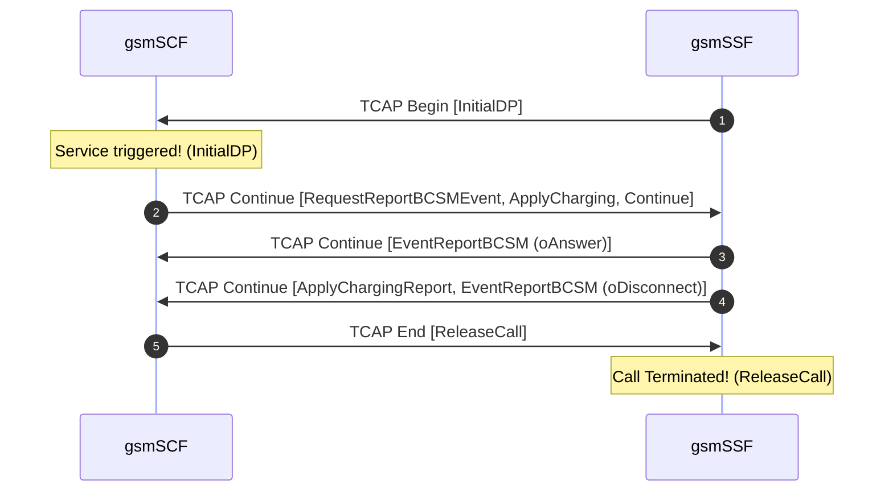

# Reference Example: Call Flow Signaling Analysis Report

This is a reference example demonstrating the standardized output layout generated by the trace analyzer skill.

## 📊 Executive Signaling Summary

| Packet | Time (Relative) | Originating Node | Destination Node | Protocol | Message Type / Event |
| :--- | :--- | :--- | :--- | :--- | :--- |
| #1 | 0.000s | gsmSSF (10) | gsmSCF (100) | **SIGTRAN** | **TCAP Begin**: `InitialDP` |
| #2 | 0.000s | gsmSCF (100) | gsmSSF (10) | **SIGTRAN** | **TCAP Continue**: `RequestReportBCSMEvent`, `ApplyCharging`, `Continue` |
| #3 | 1.000s | gsmSSF (10) | gsmSCF (100) | **SIGTRAN** | **TCAP Continue**: `EventReportBCSM` (oAnswer) |
| #4 | 75.000s | gsmSSF (10) | gsmSCF (100) | **SIGTRAN** | **TCAP Continue**: `ApplyChargingReport`, `EventReportBCSM` (oDisconnect) |
| #5 | 75.000s | gsmSCF (100) | gsmSSF (10) | **SIGTRAN** | **TCAP End**: `ReleaseCall` |

---

## 🔄 Call Flow Sequence (Mermaid Representation)

